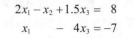
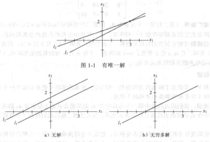

# 《线性代数及其应用》笔记

### 1.线性代数中的线性方程组

线性代数方程组是线性代数的核心

#### 1.1线性方程组

**`线性方程组`是由一个或几个包含相同变量的线性方程组成的**，例如

##### 1.1.1解和解集

**线性方程组的`解`是一组数，当解替代方程内的变量时所有方程的两边相等。**

当一组解(5,6.5,3)带入上面方程时，两边相等

**方程组所有可能的解的集合称为线性方程组的`解集`**

**若两个线性方程组有相同的解集，则这两个线性方程组称为`等价的`**

线性方程的解有下列三种情况：

- 无解(两条线平行)
- 有唯一解(两条线有唯一交点)
- 有无穷多解(两条线重合)

当有一个或无穷多解时，称这个线性方程是**相容的**；当无解时，是**不相容的**

##### 1.1.2矩阵记号

