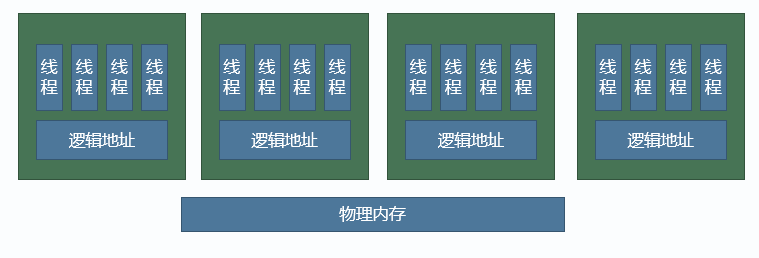
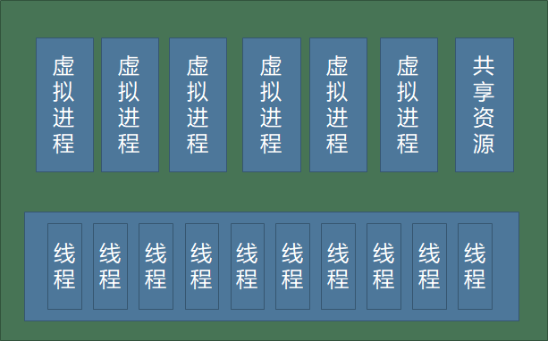

# 多线程多进程框架设计

## 第二节 多进程多线程

需求：RTS帧同步游戏计算量巨大，表现层和逻辑层都需要一个单独线程时。

### 目的

- 利用多核
- 并发计算
- 节省资源

### 利用多核-多个线程

- 单进程多线程
  - 优点：
    - 线程之间可以共享资源，配置、网络都可以共享。
    - 线程之间通信效率高，写完逻辑丢到队列里执行。或者保证线程安全前提下可以直接访问。
  - 缺点：
    - 线程竞争，非常危险，出现线程问题，bug十分难找
- 多进程单线程
  - 优点：没有线程竞争，开发容易。
  - 缺点：
    - 资源无法共享，占用内存大。
    - 进程之间通信代价高，通过网络通信，通过Socket，需要定协议、序列化反序列化等等。
    - 客户端情况下有些场景下无法使用多进程，比如IOS App。不能起一个单独的线程，比较致命。
- 多进程多线程

### 两者结合-虚拟进程

### 约束

共享资源要保证线程安全，加锁

虚拟进程之间不能相互访问 

虚拟进程之间只能使用消息通信

### 好处

虚拟进程中开发写法仍然是单线程

共享的资源加锁保证线程安全，这样锁的使用比较少，容易控制

创建虚拟进程代价非常低

## 第三节 线程安全

### 线程安全的几种情况