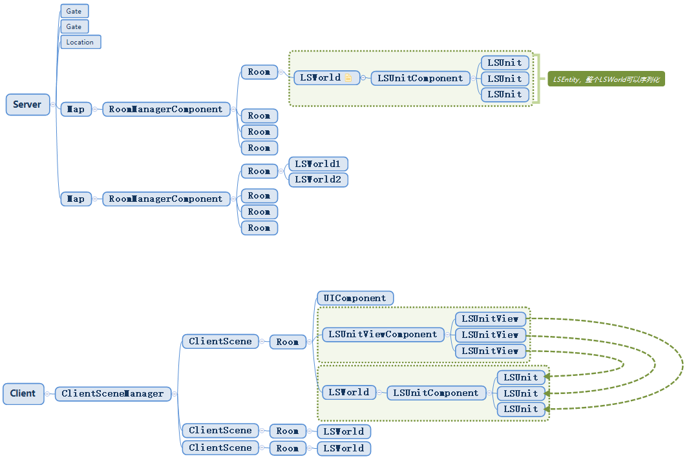

# 帧同步设计

## 第1节 简介

### 状态同步

- 逻辑计算在服务器
- 服务器同步变化给客户端
- 客户端只做表现

###  帧同步

- 服务器广播客户端指令
- 逻辑计算在客户端逻辑层
- 客户端逻辑层发送变化给表现层
- 相当于把状态同步的服务器挪到了客户端逻辑层

#### 适合的场景

操作少，逻辑变化多

同场景玩家数少，需要同时同步的数量少

同视野单位特别多的场景

只适合开房间类型

不太需要单位信息保密的场景，安全性等级较低的场景

以上条件缺一不可

#### 帧同步优势

- 流量少
  - 具体流量多少看玩家数量
- 录像文件小
  - 只需要记录操作
  - 状态同步则是保存协议消息
- 服务器不做验证的话，服务器消耗小

#### 帧同步误区

- 帧同步手感更好
- 帧同步开发简单，难度低
- 帧同步对网络速度要求低
  - 如果需要体验流畅反而网络要求更高
- 帧同步各个客户端表现一模一样
  - 只能保证逻辑层一致
- 帧同步可以减少服务器

#### 帧同步的几种方案

- 服务器消息驱动帧同步：服务端固定帧率收集消息，定时广播，客户端指令没有帧的概念，帧是由服务端消息驱动的，适合玩家数量稍多的场景，预测只能做表现层的预测，开发难度相对简单
- 预测回滚帧同步：服务的固定帧率收集消息，客户端也有自己的帧，适合2-3人的场景，逻辑层有做预测，预测失败则回滚，开发难度大

## 第2节 网络0GC处理

### 0GC的消除策略

0GC就是不分配，共用对象池。但是多线程情况下共用对象池存在风险。

服务端不消除GC

客户端手动消除消息GC，消除量级比较大的消息

### 0GC的方式

- MessagePool
  - 线程安全的消息对象池
- MemoryPack提供了ref的反序列化方式
  - 不是new对象的形式
- 消息中的成员回收
- 消息中容器回收，MemoryPack会对容器调用Clear，容器中最好是struct
  - MemoryPack构建struct的时候用的非反射方式，没有拆装箱避免了gc
- MemorySteam GC消除
- Udp Send Recv GC消除

### 消息的创建回收

- MessageObject.IsFromPool
  - 消息都继承于MessageObject
- 发送消息时创建，消息传到网络层序列化完成后回收
  1. 发送的时候需要自己调用Create(true);
  2. 回收是框架自动调用Dispose();
- 接受消息时创建，消息传到主线程使用完成后回收
  1. 接收的时候框架自动调用FetchMessage
  2. 回收需要自己调用Dispose();

### MemoryBuffer创建回收

MemoryBuffer是MemoryStream子类，主要为了配合MemoryPack用的

IBufferWriter接口

框架自动回收，使用者不需要关心

### MemoryPack Source Generator

不像protobuf通过反射生成代码，完全支持unity

AssemblyBuilder失效

使用IDE编译Dll，所有代码放到Unity.Codes工程里面，开启ENABLE_CODES启用dll模式，跟ET7中相反

Unity.Codes分成Model跟Hotfix，报错，没找到问题，所以客户端热重载暂时不能用

## 第3节 框架层调整

1. EntityRef
   - 原本对Entity的引用只能通过InstanceId，现在增加EntityRef持有Entity
   - 当Entity被释放或者回收掉时，再去取EntityRef则为null
2. Entity不再统一注册到Root中
   - 在原本的设计中Root管理Entity，通过InstanceId为key来取出Entity。
   - 只有Actor对象的Entity挂载了MailboxComponent的才会注册到ActorMessageDispatcherComponent中
3. TypeSystem EntitySystemSingleton，可扩展的Entity System机制
   - 把之前EventSystem内一些生命周期的事件，抽出到EntitySystemSingleton中。
   - LSEntitySystemSingleton
4. Domain IScene, 更完善，Scene的代码都简化了
   - 只要Entity有IScene接口都可以是Domain
   - Scene中简化了Parent和Domain的字段
5. Entity中Components改成SortedDictionary，保证有序
   - 原本的Entity中的Components只是字段，在不同机器上的hash值不一样顺序也不一样。帧同步则会有问题，在Entity执行Disponse时，不同机器移除顺序不同则会造成问题。
6. Mongo序列化BeginInit, SerializeSystem
   - Entity序列化时，调用BeginInit遍历判断Componets是否有ISerializeToEntity接口，有则加入ComponentDB
   - 增加SerializeSystem，用于判断有些同类型Entity哪些需要存储哪些不需要存储。
7. 配置文件改成了Bson，直接支持Dictionary

## 第4节 帧同步架构



- 客户端的Room相比服务端的Room多了个表现层
- 客户端挂载的是LSClientUpdate，服务端挂载的是LSServerUpdate，客户端相对服务端而言多了预测回滚的功能。

## 第5节 LSEntity

### 为什么要LSEntity

1. 限制Entity的Id生成
   - Entity的id都是通过IdGenerater生成，那么不同设备上生成出来的id会不一致。会导致逻辑不一致。
   - LSEntity AddChild和AddComponent时生成的id是统一的。
   - LSEntity 的Id序列化和反序列操作后不变。
2. LSWorld不能使用Update LateUpdate Load等等
   - 需要专用的Update类似于FixedUpdate，每固定时间触发。
   - 服务器的Load和客户端的Load，代码不一致可能导致结果也不一致。
3. 序列和反序列化导致InstanceId跟System绑定关系失效，不能写一个老式的FixedUpdate
   - 回滚逻辑在把操作进行序列化和反序列后，instanceId产生变化会自增1，导致失效。
4. 用Id跟System绑定，专用的 LSUpdateSystem
   - FixedUpdateSystem的实现
5. 可以针对LSEntity，加上float分析器限制

### LSWorld：LSEntity

LSWorld只能挂在LSEntity

1. 定点数部分，纯逻辑层
   - 没必要所有代码都使用定点数，只有在于帧同步玩法内才需要。比如Room内LSWorld部分才使用定点数。
2. 序列化反序列化, 回滚的部分
   - 只有逻辑层、纯定点数部分才需要回滚。
3. Id生成器
4. 随机数
   - 服务器生成的随机数种子，使客户端通过Id生成器生成的Id能保持一致。
5. LSUpdater，注意，这个不是fixedUpdate，记录有哪些Entity有LSUpdate

### System

- LSEntitySystemSington
- LSUpdateSystem
- LSRollbackSystem
  - 和表现层做和解用的

### LSUpdater.Update驱动

Room上挂有一个Updater组件，在固定帧调用LSWorld的Updater

客户端的Update间隔和服务端不一致，客户端可能需要动态调整，时间的膨胀、搜索。在服务端的Room上挂服务端的Update组件，在客户端的Room上挂客户端的Update组件。

### LSRollbacke

在表现层使用，用于状态回滚。表现层向逻辑层进行一一核对。

## 第6节 预测回滚

### Room

#### FrameBuffer输入缓存

给记录的帧率限定数量，当超过限定值时则从记录的第一帧开始覆盖。

- 记录所有人的输入。每一帧的输入，每一帧都是一个字典。
- 每一帧的快照，记录帧并序列化。
- 每一帧都有一个hash值，用于做帧内容的对比。

#### FixedTimeCounter 固定时间计算，固定时间可改变

用来计算FixedUpdate的时间，到FixedTime的时间才会调用LSWorld的Update。

为什么不用固定时间调用？因为每帧时间不是固定的，客户端的时间会膨胀收缩。如果客户端的时间比服务端慢了，那么客户端的帧的间隔会减小。因为要保证客户端的预测帧一直跑在服务器的权威帧之前。

#### LSWorld

Room的child 可以有多个，持有Ref的引用性能会高些。

#### PredictionFrame 预测帧 AuthorityFrame 权威帧

预测帧就是客户端根据玩家操作预测出来的帧。服务器在做转发时，如果当前帧有玩家没输入则使用上一帧输入的数据做预测。

权威帧对客户端而言就是服务器下发的帧，确认帧。对服务端而言不做预测所以都是权威帧。

### 预测

作用：

1. 本地立即响应
2. 提前发送操作给服务端，服务端的权威帧跑到了后可以马上广播

策略：

1. 客户端预测自己的输入，直接获取。
2. 客户端预测别人的输入，取上一帧的输入。避免权威帧到了之后做过多的回滚操作，因为大概率操作和上一帧一样。 
3. 服务的预测，时间到了，客户端的输入没有发送过来，直接取客户端上一帧的输入，相当于丢弃客户端的输入。

### 权威消息处理

1. 权威消息比预测消息早

   如果预测消息晚于权威消息，那么直接使用权威帧就不用预测了。

2. 权威消息跟预测内容一样

   消息一样则不用处理

3. 权威消息跟预测消息不一致

   如果和预测消息不同，那么就需要进行回滚。客户端先把权威帧的数据拷贝到预测帧中，然后回滚到权威帧时的world，然后执行权威帧。权威帧后面从帧数则要重新进行预测。

   表现层，遍历Room下所有非LSEntity的Components，因为LSEntity是数据层使用的，然后做递归遍历执行所有的RollbackSystem。

## 第7节 客户端时间膨胀收缩-检测不同步

客户端的预测帧需要在服务端处理到权威帧下一帧之前到达服务端。

### 动态调整客户端fixedTime

每秒钟，服务端发送客户端的消息延迟时间给客户端 Room2C_AdiustUpdateTime

#### **消息延迟的时间怎么算？**

比如当服务器跑到第2帧了，但是服务器只记录了第0帧的输入数据，那差距就是2帧的时间。

当客户端收到服务端同步的消息延迟时，缩放update的间隔，在一秒内完成调整(把每一帧的时间平均分一下)。

#### 调整公式

`新的一帧时间 = （原来的一帧时间 + ( diffTime - 一帧时间 ) ）/ ( 1000 / 一阵时间 )`

ps: `diffTime - 一帧时间` ，因为预期是快一帧的时间所以减去一帧时间。

#### 调整限制

给调整的时间加个限制，如果一秒内调整不完那就放到下一秒调整。

最快一秒25帧，最慢一秒15帧

### 不同步检测

客户端权威帧改变的时候，计算lsworld序列化的hash值给服务端，服务端对比hash值

## 第8节 录像Replay

### 帧同步录像包含信息

1. 记录初始化信息

   玩家、时间、版本号这类信息

2. 记录每帧输入

   记录对局中的每一帧的数据

3. 定期记录LSWorld序列化

   如果没有序列化LSWorld，那在回放指定帧时计算过程会很长，计算过程可能导致卡顿。

   比如每一分钟记录一次，播放指定帧时直接取出序列化文件反序列化。

   

### LSReplayUpdater

LSReplayUpdater是从Replay中取出帧指令执行的，跟客户端和服务端的updater从framebuffer中取数据不同。

### Replay跳转

JumpReplay

如果在replay时快照的下标和当前权威帧计算出来的下标一致时，则不再取出快照进行序列化。因为快照是同一份。

如果跳转的帧小于当前的权威帧，那么还是需要反序列快照进行播放。

`fame/快照记录的时间=快照下标`

### Replay加速播放

ChangeReplaySpeed

调整每一帧播放的间隔时间

## 第9节 断线重连

主要在loginGate的部分

1. 判断账号是否在线，需要做顶号操作。可能是旧连接保持连接或者被顶号。

2. 判断是否在帧同步房间内。

3. 取出当前room数据转发给客户端，客户端根据数据生成room

4. 把session挂上玩家，playersession赋值session

   之前的设计session是一个entity。帧同步这里则是PlayerSessionComponent上的一个变量。这样做的好处就是session如果空了，下次断线重连赋值后就可以直接做转发。判空就行，不用判断连接状态。

5. 客户端收到Reconnect消息时，进行场景切换。SceneChangeToReconnect

## 第10节 同步方式变种

### 多个LSWorld

比如守望先锋有两个world，一个计算战斗一个计算回放。两个并行的逻辑层，在进行回放的时候把world进行切换一下就可以看到战斗回放。

### 取消每帧序列化

可以再进行抽象，抽象出`权威world`和`预测world`。就不需要每帧都进行序列化，当发生回滚时只需要把`权威world`copy到`预测world`中然后生成新的`预测world`，可以减少每帧序列化产生的gc。

缺点就是需要同时计算两个world，计算量会更大。

### 守望先锋状态帧

守望先锋既同步`操作帧`，也同步`状态`。每帧计算状态脏数据，同步的状态是脏数据。

因为是纯struct结果，很容易做内存对比取出脏数据。

如果帧预测成功，则丢弃服务器下发的脏数据。

帧预测失败则回滚到权威帧，然后应用服务器发过来的脏数据包，继续执行到预测帧。

优点：脏数据自动计算

缺点：需要用纯粹的ECS进行内存对比，或者通过计算差异的代码来计算差异，不够灵活。

### ET状态帧

1. ET不需要自动计算差异，仍然和做MMO一样，计算变化的消息，每帧把变化的消息打包同步给客户端。
2. 帧预测成功，则丢弃消息。
3. 帧预测失败则回滚到权威帧，应用服务器发过来的变化消息，继续执行到预测帧。
4. 优点：不需要纯ECS，很灵活。
   缺点：需要跟MMO一样处理任何变化，创建不同的变化消息协议，无法自动化。

### ET状态帧继续扩展

做两个world，一个权威world，一个预测world。服务器始终和客户端的权威world做状态同步，所以权威world一直是正确的数据。

使用ET状态帧同步，服务端可以做AOI裁剪，只同步玩家能看到的减少数据和计算量。预测也可以只关心看到的数据。

不用定点数，因为服务端权威world和客户端的权威world只做状态同步，所以可以不使用定点数。客户端相当于只充当表现层，真正的逻辑层在服务端。

预测失败，则复制权威world到预测world

定期同步权威world到预测world，进行校准。

甚至可以权威world和预测world跟mmo一样只是部分逻辑层。相当于只是状态帧同步加上一个帧预测。

### ET状态同步预测回滚

状态同步，客户端都是表现，可以认为是表现层的预测回滚。moba等无法逻辑层预测回滚的游戏也能使用这种表现层预测回滚的形式

比如说demo鼠标点击移动做预测回滚

本地寻路完成立即移动，不用等服务端返回。向服务端发送寻路请求带一个客户端的时间

服务端返回寻路消息，这个时候，本地可以根据客户端这次移动了多少时间，重新计算服务端返回的路径应该走到了什么位置。然后表现层插值过去

收到stop的消息，预测失败，则立即stop到指定位置

### 更多方式

大家取发掘，根据项目灵活应变

定点数物理库:

https://et-framework.cn/d/1501-by/3

## 第11节 补充

### Updater中为什么要排序？

**LSWorld中的updater中的id为什么要排序？**

**两个设备计算一致，id插入的顺序也一致为什么要排序？**

Updater中的Entity是RegisterSystem注册进去的

反序列化注册Entity domain的时候会RegisterSystem

反序列化注册domain是从上到下执行的。

但是在运行时执行的顺序无法保证。而实际运行中的Updater并不是按这个规律执行

所以都用排序的方式，保持一致性。

**帧同步逻辑内有关执行顺序的逻辑都需要小心，因为执行顺序不同造成的结果也是不同的。**

### 预测回滚帧同步中逻辑层不能用协程

预测回滚帧同步中逻辑层不能用协程，服务端驱动的状态帧同步可以

```c#
// 1
await F1(); // 调用F2
// 2
await F2(); // 调用F3
// 3
await F3(); // 调用F4
// 4
await F4();
//第四帧回滚到第一帧，协程F1重新执行，没什么问题
//第四帧回滚到第二帧，协程状态机并不会重新回到第二帧的状态，导致协程丢失
```

因为协程的连续调用是链式反应。调用F2函数依赖F1函数执行完后才会调用。所以就算数据回滚了，函数的调用顺序也是有依赖关系。所以不能用协程。

### 预测回滚帧同步中使用事件的注意事项

#### 逻辑层抛出事件，表现层订阅事件

- 在回滚的时候，就不能触发表现的事件。因为当回滚时，如果表现层监听了逻辑层抛出的事件，那么就会造成表现层的错误。
- 解决办法是回滚过程中修改掉LSWorld的SceneType，这样回滚过程中的事件，表现层就订阅不到了
- 回滚完成再把LSWorld的SceneType修改正确
- 同样，两个demo中all in one，都是靠domain的SceneType来区分事件的
- 更加发散，如果使用权威world跟预测world的方案，区分事件也是一样通过SceneType来区分

### 怎么做预测？

预测只是希望预测准确减少回滚的机率，所以只要计算量不大，怎么准确怎么来就行了

一般容易预测的就是一直触发的输入，比如移动输入，FPS机枪一直按着射击等等

按一下就弹起的键一般很难预测准确，就没必要预测了

比如某个职业有设计技能，需要一直按着按键，那么我们就可以做这种预测

### 浮点型分析器限制

LSEntity的浮点型限制，一个类中有任何包含浮点类型的都会编译报错

```c#
public class Test: LSEntity

{
    public float a;

    public List<double> b;

    public Dictionary<float, int> c;

    public Dictionary<int, double> d;

    public Dictionary<int, HashSet<double>> e;

}
```

