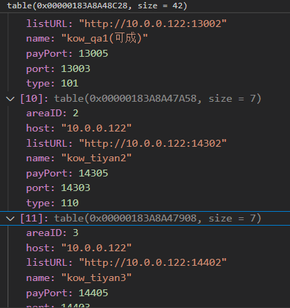
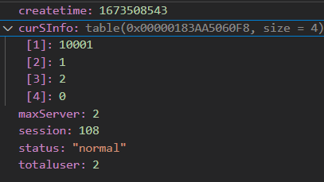

## 完整游戏流程

### 设置游戏环境

#### 设置目标帧率

`#if UNITY_IOS
		Application.targetFrameRate = 60;
#else
        Application.targetFrameRate = 45;
#endif`

#### 是否跑在后台

`Application.runInBackground = true;`

#### 路径定义(资源路径)

#### 语言设置

1. 设置当前游戏语言
2. 加载当前语言，文本资源包

#### 加载配置表

#### 加载游戏开始模块

这里一般为登录界面。到正式登录成功前使用的资源。这部分一般不做热更。

在正式登录后这里的资源需要做卸载。

这里可以在开始做个场景，做资源加载。加载完直接进入Login界面场景

### 登录界面

#### 是否有热更资源

这步应该是放在设置游戏环境中的，先放这里。

检查CDN版本号是否与本地一致

#### 下载服务器列表

Http访问下载服务器列表(json格式)，包含服务器名、端口、支付端口、url

服务器可以添加type区分是否为正式服、或者其他类型服务器

#### 查询玩家数据

点击登录后，向指定服务器http请求玩家信息基础信息，id+密码。

通过账status判断服务器的状态，是否开服、或维护中。

这里通过状态判断接下来逻辑走到哪里。

选游戏服界面、维护界面

#### 选服界面

通过玩家数据获取  默认的服务器id，已经服务器状态

#### 登录界面

开始连接登录服