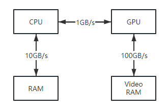
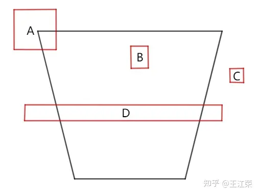

# ComputeShader基础概念及应用场景

## GPGPU编程

非图形应用情况下使用GPU的情况称为GPGPU。

对于GPGPU编程而言，用户通常需要将GPU计算后的结果返回到CPU中。这就涉及到将数据从GPU显存（Video Memory）中拷贝到CPU系统内存（System Memory）中的操作，该操作非常的**慢**。但是相比使用GPU来计算所提升的运行速度而言，可以忽略此问题。

下图展示了CPU和RAM、GPU和VRAM、CPU和GPU之间的相对内存带宽速度（图中的数字只是说明性的数字，以显示带宽之间的数量级差异），可以发现瓶颈在于CPU和GPU之间的内存传输。



## ComputeShader

图形API中的一种可编程着色器，独立于渲染管线之外，但是可以对GPU资源（存放在显存中）进行读取和写入操作。

通过GPU进行多线程的计算，并且可以将`ComputeShader`的计算结果作为渲染管线的输入。

文件扩展名为`.compute`

### kernel

一个CS中至少要有一个kernel才能被唤醒  

\`#pragma kernel xxxx`

### numthreads

定义一个线程组（Thread Group）中可以被执行的线程（Thread）总数量。

`[numthreads(8,8,1)]` 线程的数量=tX * tY * tZ

**每个核函数前面我们都需要定义numthreads**，否则编译会报错。

每个线程组都有一个各自的共享内存，不能访问别的组对应的共享内存。

先用`numthreads`定义好核函数对应线程组里的线程数量，再用Dispatch定义用多少线程组(gX\*gY\*gZ)来处理这个核函数。

| 参数                | 值类型 | 含义                                                         | 计算公式                                                     |
| ------------------- | ------ | ------------------------------------------------------------ | ------------------------------------------------------------ |
| SV_GroupID          | int3   | 当前线程所在的线程组的ID，取值范围为(0,0,0)到(gX-1,gY-1,gZ-1)。 | 无                                                           |
| SV_GroupThreadID    | int3   | 当前线程在所在线程组内的ID，取值范围为(0,0,0)到(tX-1,tY-1,tZ-1)。 | 无                                                           |
| SV_DispatchThreadID | int3   | 当前线程在所有线程组中的所有线程里的ID，取值范围为(0,0,0)到(gX*tX-1, gY*tY-1, gZ*tZ-1)。 | 假设该线程的SV_GroupID=(a, b, c)，SV_GroupThreadID=(i, j, k) 那么SV_DispatchThreadID=(a*tX+i, b*tY+j, c*tZ+k) |
| SV_GroupIndex       | int    | 当前线程在所在线程组内的下标，取值范围为0到tX*tY*tZ-1。      | 假设该线程的SV_GroupThreadID=(i, j, k) 那么SV_GroupIndex=k*tX*tY+j*tX+i |

#### **Warp**

如果是NVIDIA的显卡，线程组中的线程又会被划分成一个个**Warp**，每个Warp由32个线程组成，一个Warp通过SM来调度。在SIMD32下，当SM操控一个Warp执行一个指令，意味着有32个线程同时执行相同的指令。**假如我们使用numthreads设置每个线程组只有10个线程，但是由于SM每次调度一个Warp就会执行32个线程，这就会造成有22个线程是不干活的（静默状态），从而在性能上无法达到最优。**因此针对NVIDIA的显卡，我们应该将线程组中的线程数设置为32的倍数来达到最佳性能。如果是AMD显卡的话，线程组中的线程则是被划分成一个个由64个线程组成**Wavefront**，那么线程组中的线程数应该设置为64的倍数。因此**建议numthreads值设为64的倍数**，这样可以同时顾及到两大主流的显卡。

### c#部分

以往的`Vertex shader`和` Fragment shader`我们都是给它关联到`Material`上来使用的，但是CS不一样，它是**由c#来驱动**的。

### ComputeBuffer

用来把CPU中自定义的Struct数据读写到显存中。在C#中创建并填充它，然后传递给`ComputeShader`或者其他的Shader中。

#### 定义

```c#
ComputeBuffer buffer = new ComputeBuffer(int count,int stride)
    
//使用完Release掉
buffer.Release();
```

count代表buffer中元素的数量，而stride指每个元素占用的字节。

**ComputeBuffer中的stride大小必须和RWStructuredBuffer中的每个元素大小一致。**

#### 填充

```c#
//参数为自定义的struct数组
buffer.SetData(T[]);
```

#### 传递到CS

```c#
public void SetBuffer(int kernelIndex, string name, ComputeBuffer buffer)
```

#### ComputeBufferType

| Default           | ComputeBuffer的默认类型，对应HLSL shader中的StructuredBuffer或RWStructuredBuffer，常用于自定义Struct的Buffer传递。 |
| ----------------- | ------------------------------------------------------------ |
| Raw               | Byte Address Buffer，把里面的内容（byte）做偏移，可用于寻址。它对应HLSL shader中的ByteAddressBuffer或RWByteAddressBuffer，用于着色器访问的底层DX11格式为无类型的R32。 |
| Append            | Append and Consume Buffer，允许我们像处理Stack一样处理Buffer，例如动态添加和删除元素。它对应HLSL shader中的AppendStructuredBuffer或ConsumeStructuredBuffer。 |
| Counter           | 用作计数器，可以为RWStructuredBuffer添加一个计数器，然后在ComputeShader中使用IncrementCounter或DecrementCounter方法来增加或减少计数器的值。由于Metal和Vulkan平台没有原生的计数器，因此我们需要一个额外的小buffer用来做计数器。 |
| Constant          | constant buffer (uniform buffer)，该buffer可以被当做Shader.SetConstantBuffer和Material.SetConstantBuffer中的参数。如果想要绑定一个structured buffer那么还需要添加ComputeBufferType.Structured，但是在有些平台（例如DX11）不支持一个buffer即是constant又是structured的。 |
| Structured        | 如果没有使用其他的ComputeBufferType那么等价于Default。       |
| IndirectArguments | 被用作 Graphics.DrawProceduralIndirect，ComputeShader.DispatchIndirect或Graphics.DrawMeshInstancedIndirect这些方法的参数。buffer大小至少要12字节，DX11底层UAV为R32_UINT，SRV为无类型的R32。 |

### UAV（Unordered Access view）

在渲染Shader中使用的资源称为SRV（Shader resource view），比如Texture2D是只读的。但是在ComputeShader中，往往需要写入操作，因此SRV不能满足需求。

UAV允许多个线程临时的无序读/写操作，不会产生内存冲突。

RWTexture、RWStructuredBuffer都属于UAV数据类型，**支持在读取的同时写入**。只能在FragmentShader和ComputeShader中使用。

如果RenderTexture不设置`enableRandomWrite`，当传递一个renderTexture给RWTexture时就会报错。

`the texture wasn't created with the UAV usage flag set!`

### groupshared

每个线程组都有一块属于自己的内存空间，通过`groupshared`关键字定义的变量会被存放在线程组内的共享内存中

```
groupshared float4 vec;
```

共享内存支持的最大大小为32kb，单个线程最多支持对共享内存进行256byte的写入操作。

```
Texture2D input;
groupshared float4 cache[256];

[numthreads(256, 1, 1)]
void CS(int3 groupThreadID : SV_GroupThreadID, int3 dispatchThreadID : SV_DispatchThreadID)
{
    cache[groupThreadID.x] = input[dispatchThreadID.xy];

    GroupMemoryBarrierWithGroupSync();

    float4 left = cache[groupThreadID.x - 1];
    float4 right = cache[groupThreadID.x + 1];
    ......
}
```

#### GroupMemoryBarrierWithGroupSync

GroupMemoryBarrierWithGroupSync 同步组内线程，会阻塞线程组中所有线程的执行，直到所有共享内存的访问完成并且线程组中的所有线程都执行到此调用。

### Shader.PropertyToID

在CS中定义的变量依旧可以通过 Shader.PropertyToID("name") 的方式来获得唯一id。

在频繁利用`ComputeShader.SetBuffer`对相同变量赋值的时候，将id进行缓存避免GC。

```c#
int grassMatrixBufferId;
void Start() {
    grassMatrixBufferId = Shader.PropertyToID("grassMatrixBuffer");
}
void Update() {
    compute.SetBuffer(kernel, grassMatrixBufferId, grassMatrixBuffer);
    
    // dont use it
    //compute.SetBuffer(kernel, "grassMatrixBuffer", grassMatrixBuffer);
}
```

### 小节总结

- 一个CS中至少要有一个kernel才能被唤醒 ，类似于main函数
- numthreads值设为64的倍数，这样能保证在调用时性能最优
- 在ComputeShader中因为是多线程操作，如果需要对数据进行写入需要使用UAV数据类型
- 使用Shader.PropertyToID缓存参数id，避免频繁访问name造成的gc

## 视锥体剔除

View Frustum Culling

### 为什么需要视锥剔除？

如果不对物体做剔除操作，那么视锥体范围内看不到的物体也会通过CPU提交DrawCall传递到GPU中，并参与到顶点着色器的计算，如果有几何着色器一样会参与计算。

为了不让看不见的物体在**Rendering Pipeline中耗费着大量的计算，造成了不必要的消耗**所以需要剔除。

### 剔除原理

物体可能有成千上万的面和顶点，因此我们往往会给每个物体定义一个包围盒或者包围球。

那么问题就简化成了**如何判断包围盒或者包围球和视锥体的内外关系**



首先我们可以通过判断包围盒的每个**顶点与视锥体的关系**来判断整个包围盒与视锥体的关系。其中我们可以**把视锥体看作是六个面的集合，如果一个点都在六个面的背面，那么这个点就在视锥体内**。但是如果包围盒有任何一个顶点在视锥体内，我们就当做AABB属于在视锥体内的话，那么对于物体D（比如一面墙）的AABB明显不适用，它的所有顶点都不在视锥体内，但是我们依旧需要渲染它。此时我们需要逆向思维，即**若包围盒的所有顶点都在视锥体的某个面外，那么我们认为这个物体是要被剔除的**。例如C的所有顶点都在右边那个面外，需要剔除，D的所有顶点并没有全部在某个面外因此保留。

### CPUCulling

往往剔除逻辑都会在CPU中进行。

并且还会使用例如**八叉树**的形式对场景进行划分，比如某个节点所在的包围盒在视锥体外，那么该节点下的所有子节点都必然在视锥体外，从而减少大量计算。

### GPUCulling

现如今我们可以使用ComputeShader来完成物体级别的剔除，利用cs在GPU端判断物体包围盒和视锥体的关系。

### Graphics.DrawMeshInstancedIndirect

如果我们用CS来实现Culling判断，那么需要进行判断的包围盒数据信息会传入CS中，在剔除完成后将剔除后的数据信息传回CPU中，再传递给具体GPU进行渲染。

大量的数据会在CPU和GPU之间重复传递，造成极大的性能问题，特别在手机端传输带宽受限的情况下是无法承受的。

使用`DrawMeshInstancedIndirect`可以把显存里的数据直接Draw到渲染管线中，而不是传统的从CPU发送数据。