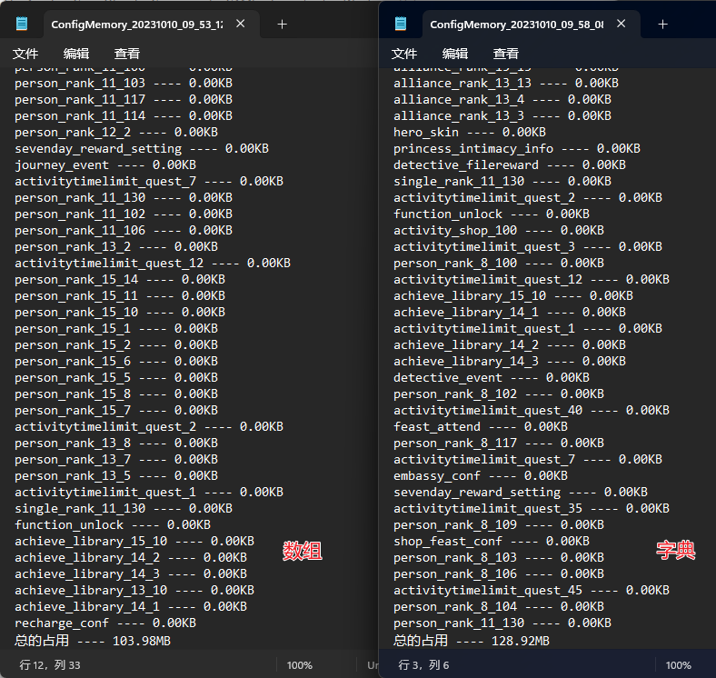
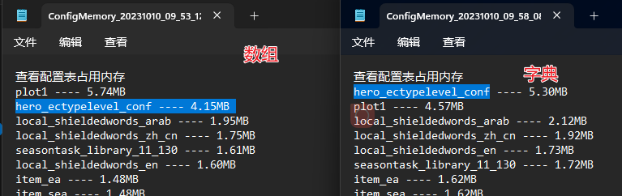
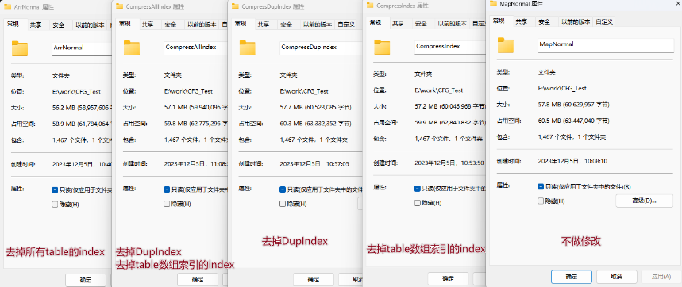

# Lua配置方式不同的对比

## Table元素Map改为Arr

资源大小

RunTime运行时内存大小

对比defaultValues参数较多的配置，在runtime时内存占用会较大。因为字典状态下会抽出共用的参数为defaultValues，并通过设置元表的方式去获取，减少了单条数据内的数据量。

而数组状态下索引位置不能改变，所以不能用defaultValues的方式来设置元表，增加了这部分数据量。

## 更近一步

