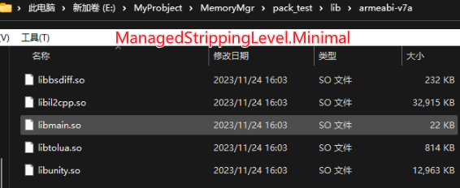
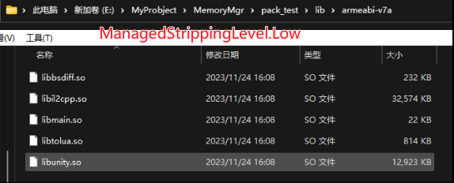
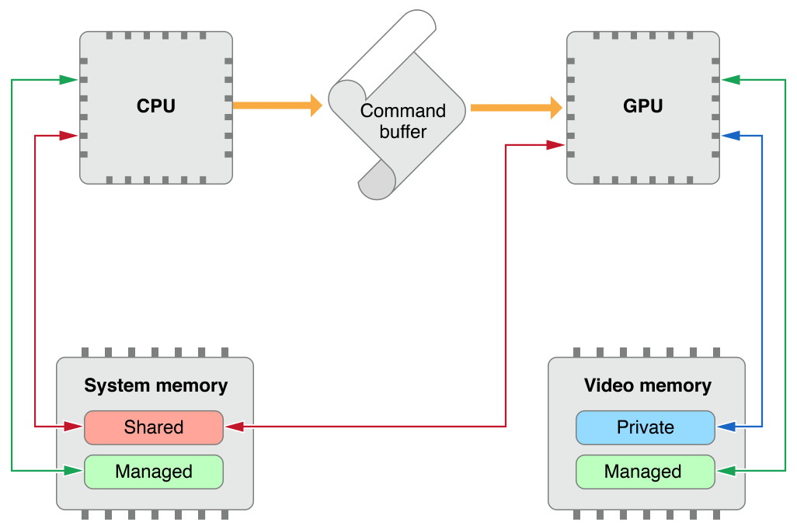
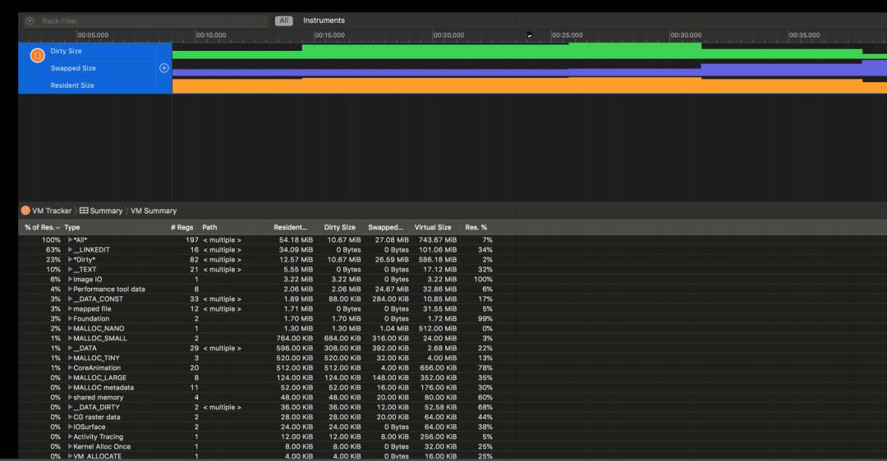
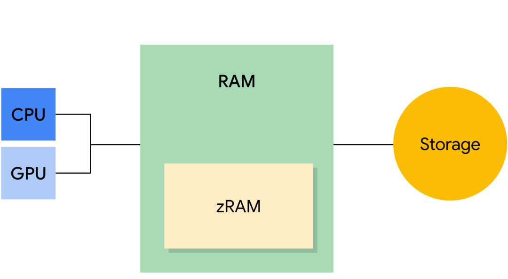

# Unity内存分布及分析

## 内存分类

Unity按照内存管理方式分为：**引擎管理内存**和**用户管理内存**。引擎管理内存即引擎运行的时候自己要分配一些内存，例如很多的Manager和Singleton，这些内存开发者一般是碰触不到的。用户管理内存也就是我们开发者开发时使用到的内存，需要我们重点注意。

### 托管内存 Managed Memory

**Managed Memory的内存管理是自动的，会通过GC来释放。**

使用托管堆和[垃圾回收器](https://en.wikipedia.org/wiki/Garbage_collection_(computer_science))自动分配和分配内存的受控[内存](https://docs.unity.cn/cn/2021.3/Manual/performance-memory-overview.html#managed-memory)层。

脚本虚拟机（scripting virtual machine，VM）实现了托管内存系统（有时候也被叫做脚本内存系统）。VM 将托管内存分成了三个部分：

- 托管堆（managed heap）
- 同 CLR 的托管堆一样，被垃圾回收器（GC）管理。
- 脚本栈（scripting stack）
- 原生 VM 内存（native VM memory）
- 里面包含一些与生成的可执行代码相关的内存，比如泛型的使用，反射使用的类型的元数据。以及一些维持 VM 运行所需的内存。

### 非托管内存 Unmanaged Memory

C# 非托管内存层（C# unmanaged memory layer）允许你用 C# 的方式访问原生内存来微调（fine-tune）内存分配。

通过使用 `Unity.Collections` 域名空间下的数据结构，如 `NativeArray`，即可访问非托管内存。

如果使用 ESC 下的作业系统（Job system）和 Burst，则必须使用 C# 非托管内存。

### 本机内存 Native Memory

**Native Memory并不会被系统自动管理，需要我们手动去释放。**

Unity 用于运行引擎的 C++ 内存。在大多数情况下，用户是不能直接访问或者修改这部分内存的。

原生内存里面存储了项目中的场景、资源（assets，比如纹理、网格）、图形API、图形驱动、子系统、插件缓存以及其他的内存分配。用户通过封装的上层 C# 接口来间接访问和操作这些内存中的数据。

#### 优化Native Memory

优化Native Memory就是对Asset大小进行优化，以最合理的方式进行资源设置是优化Native Memory的关键。

##### Scene

导致Native Memory增长的原因，最常见的就是Scene。因为是c++引擎，所有的实体最终都会反映在c++上，而不会反映在托管堆上。所以当我们构建一个GameObject的时候，实际上在Unity的底层会构建一个或多个object来存储这一个GameObject的信息（Component信息等）。所以当一个Scene里面有过多的GameObject存在的时候，Native Memory就会显著的上升，甚至可能导致**内存溢出**。

<!--注：当我们发现Native Memory大量上升时，可以先着重检查我们的Scene。-->

##### Code Size

代码也是占内存的，需要加载进内存执行。**模板泛型的滥用**，会影响到Code Size以及打包速度（IL2CPP编译速度，单一一个cpp文件编译的话没办法并行的）。例如一个模板函数有四五个不同的泛型参数（float，int，double等），最后展开一个cpp文件可能会很大。因为实际上c++编译的时候我们用的所有的Class，所有的Template最终都会被展开成静态类型。因此当模板函数有很多排列组合时，最后编译会得到所有的排列组合代码，导致文件很大。

##### Managed code stripping代码裁剪

[托管代码剥离 - Unity 手册](https://docs.unity.cn/cn/current/Manual/ManagedCodeStripping.html)

在构建包体的过程会进行托管代码的裁剪过程，删除未使用或无法访问的代码，来减小包体的大小。包括从项目中的 C# 脚本生成的程序集、属于包和插件的程序集以及 .NET Framework 中的程序集。

```c#
BuildTarget buildTarget = EditorUserBuildSettings.activeBuildTarget;
            BuildTargetGroup buildTargetGroup = BuildPipeline.GetBuildTargetGroup(buildTarget);
PlayerSettings.SetManagedStrippingLevel(buildTargetGroup, ManagedStrippingLevel.Low);
```

注意有些类似反射的调用方式，在静态检测中检测为未使用，在裁剪等级高时会被裁剪掉。需要使用 [Preserve] 属性和 link.xml 文件进行标识，避免被裁剪。





##### AssetBundle

**TypeTree：**Unity前后有很多的版本，不同的版本中很多的类型可能会有数据结构的改变，为了做数据结构的兼容，会在生成数据类型序列化的时候，顺便生成一个叫**TypeTree**的东西。就是当前这个版本用到了哪些变量，它们对应的数据类型是什么，当进行反序列化的时候，根据TypeTree去做反序列化。如果上一个版本的类型在这个版本没有，那TypeTree里就没有它，所以不会去碰到它。如果有新的的TypeTree，但是在当前版本不存在的话，那要用它的默认值来序列化。从而保证了在不同版本之间不会序列化出错。

在Build AssetBundle的时候，有开关可以关掉TypeTree。

```text
BuildAssetBundleOptions.DisableWriteTypeTree
```

当我们当前AssetBundle的使用，和Build它的Unity的版本是一模一样的时候，就可以关闭。这样，一可以减少内存，二AssetBundle包大小会减少，三build和运行时会变快，因为不会去序列化和反序列化TypeTree。

### Untiy检测不到的内存

即Unity Profilter无法检查到的内存，例如用户分配的Native内存。比如自己写的Native插件（C++插件）导入Unity，这部分Unity是检测不到的，因为Unity没法分析已编译的C++是如何分配和使用内存的。还有就是**Lua**，它完全自己管理的，Unity也没法统计到它内部的情况。

## **Reserved/Used**

Reserved Total 和 Used Total为Unity引擎在内存方面的总体分配量和总体使用量。 一般来说，引擎在分配内存时并不是向操作系统 “即拿即用”，而是首先获取一定量的连续内存，然后供自己内部使用，待空余内存不够时，引擎才会向系统再次申请一定量的连续内存进行使用。

对于绝大多数平台而言，Reserve Total内存 = Reserved Unity内存 + GFX内存 + FMOD内存 + Mono内存。

### 频繁分配和释放导致应用闪退

内存分页（IOS上大部分为16K/page）是内存管理的最小单位，当Unity需要申请内存的时候，都会以block的方式（若干个页）进行申请。**如果某一页在若干次GC（IOS为8次）之后仍然为Empty的话，它就会被释放，实际的物理内存就会被还给物理内存。**

但由于**Unity是在虚拟内存中管理内存的，因此虚拟空间的地址并不会返还，所以它就变成“Reserved”的了。也就是说这些Reserved地址空间不能再被Unity重复分配了。**

所以在一个32位的操作系统上，如果虚拟内存地址发生频繁分配和释放就会导致地址空间耗尽，从而被系统杀掉。

## GC与内存碎片

Mono堆申请的物理内存是连续的，并且Mono堆在向操作系统申请扩展内存的时候，非常耗时。所以大部分情况下，Mono堆都会尽量保持自己已经申请到的物理内存，以防止之后要用。所以除了虚拟空间地址之外，Mono堆申请的内存也存在Reserved概念。

1. 由于内存的分配单位是页，也就是说如果一个页只存储了一个int值，那么该页仍然会被表示为Used，它们的物理内存不会被释放。当然如果某个内存大于一页，就会申请多个连续页。
2. 如果某个时刻，堆内存被GC了，那么这部分的物理地址就会被空出来。
3. 当下一次需要申请堆内存的时候，Mono堆会首先检查当前堆内的空间内是否存在连续的空间能容纳这次内存申请，如果不够就会进行一次GC。之后，如果还是找不到这样的block，Mono堆就会执行内存扩展操作，向操作系统要更多的内存。
4. 而这些空出来，却又不能被重复利用的内存就会成为内存碎片。它们既不能被利用，又不会被销毁。

## 各平台下的内存类型

### IOS下的内存

和Unity只关注虚拟内存不一样，OS需要关注物理内存 Physical Memory (RAM)。尤其是移动平台，更是要将有限的内存使用到极致才可以。所以不少PC平台使用的内存策略移动平台并不能用，比如交换空间（IOS只能对Clean类型的内存做Paging ）

#### Physical Memory

IOS设备上的物理芯片内存。物理内存的实际用量要扣除操作系统自身的占用量。

#### Virtual Memory (VM)

虚拟内存，OS给每个APP分配的虚拟地址空间，这和Unity的虚拟空间地址比较类似。它由内存管理单元MMU（ memory management unit），进行管理，并和实际的物理内存进行映射。前面也说过了，内存是按页分配的，早期的IOS处理器使用的是4K/页（也个别代是用64K的），A9之后统一使用16K/页。

虚拟内存一般由Clean Memory和Dirty Memory组成，包含代码段、动态库、GPU驱动，Malloc堆和一些其他的部分。

##### Clean Memory

对于开发者而言是read-only，只能由IOS系统进行写入和移除。

由Unity分配的Reserved - Used = Clean Memory的空间

- System frameworks的常量部分、应用程序的二进制文件
- 可以被释放（Page Out，iOS上是压缩内存的方式）的文件，包括内存映射文件Memory mapped file（如image、data、model等）。内存映射文件通常是只读的。
- 系统中可回收、可复用的内存，实际不会立即申请到物理内存，而是真正需要的时候再给。

如果通过文件内存映射机制memory mapped file载入内存的，可以先清除这部分内存占用，需要的时候再从文件载入到内存。所以是Clean Memory。

##### Dirty Memory

主要强调不可被重复使用的内存。

只要Unity中Reserved中的空间写入了数据就变成了Dirty Memory

- 被写入数据的内存，包括所有heap中的对象、图像解码缓冲(ImageIO, CGRasterData，IOSurface)。
- 已使用的实际物理内存，系统无法自动回收。
- 每个framework的_DATA段和_DATA_DIRTY段。

iOS中的内存警告，只会释放clean memory。因为iOS认为dirty memory有数据，不能清理。所以，应尽量避免dirty memory过大。

<!--值得注意的是，在使用 framework 的过程中会产生 Dirty Memory，使用单例或者全局初始化方法是减少 Dirty Memory 不错的方法，因为单例一旦创建就不会销毁，全局初始化方法会在 class 加载时执行。-->

#### GPU Driver Memory

OS系统使用所谓的统一架构，即GPU和CPU共享某一部分内存，比如纹理和网格数据，这些是由驱动器进行分配的。另外还有一些是GPU的驱动层以及GPU独享的内存类型（Video memory ）。



#### Compressed Memory

iOS设备没有swapped memory，而是采用Compressed Memory机制，一般情况下能将目标内存压缩至原有的一半以下。

压缩内存机制，使得内存警告与释放内存变得稍微复杂一些。即，对于已经被压缩过的内存，如果尝试释放其中一部分，则会先将它解压。而解压过程带来的内存增大，可能得到我们并不期待的结果。

从经验来看，OS会比较积极的来做压缩以减少脏内存的总量。

我们平常开发所关心的内存占用其实是 ***Dirty Size和Compressed Size两部分***，也应尽量优化这两部分。而Clean Memory一般不用太多关注。

#### FootPrint

Footprint是苹果推荐的内存度量及优化的指标。当Memory Footprint的值达到Limit line时，就会触发内存警告，并进一步导致OOM。

Footprint主要是由Dirty和Compressed组成。或者说Resident 是由Footprint和Clean组成的。Footprint没有统一标准，它会因为设备、操作系统、甚至是当前运行环境不同而不同。

#### 查看内存的几种方式

##### Xcode Memory Gauge

绿色表示内存良好，黄色是危险区域，如果不及时处理马上就会被OS杀掉。从测试的结果上来说，它总是比用VM Tracker工具测出的Dirty Memory + Compressed Memory 要大10-15M。

但实际上，这个数值并不是OS杀掉APP的唯一判断标准。一般在杀掉一个APP的时候会经过以下的步骤：

- 尝试移除Clean 内存页。
- 如果某个APP占用了太多的Dirty内存，OS发送一个内存警告过去，让它释放资源。
- 几次警告之后，如果Dirty内存仍然占用很高的话就会被Kill掉。

由于IOS杀APP的策略也是不透明的，所以如果要防止APP被系统终结，唯一的办法就是尽量降低Dirty内存。

##### VM Tracker

VM Tracker是XCode Instruments工具组里的一个。它提供比较详细的虚拟内存的分布情况，也是为一个提供Dirty Memory信息的工具。但遗憾的是它没有展示内存分配的目的和时间。



###### 表头类型：

- **Type** — 内存类型
- **Resident Size** — Resident Memory 内存
- **Dirty Size** — Dirty Memory 内存
- **Swapped Size** — Compressed Swapped Memory 内存
- **Virtual Size** — Virtual Memory 内存
- **Res. %** — Resident Memory 和Virtual Memory的占比。
- 接下来就是一些实际的类型在各个层面的具体数值了。就不一一介绍类型了，挑几个重点解释一下。
- ***All\*** — 所有的分配。
- ***Dirty\*** — Dirty Memory。
- **IOKit** — graphics driver memory,比如：render targets, textures, meshes, compiled shaders等
- **VM_ALLOCATE** — 主要是Mono Heap. 如果此项值过大，可以用Unity Profiler 来查看具体分配。
- **MALLOC_\*** — 主要是Unity native 或者是third-party plugins分配的内存。
- **__TEXT** — 只读的可执行代码段 和静态数据。
- **__DATA** — 可写的可执行 code/data。
- **__LINKEDIT** — 各种链接库的实际元数据, 比如 符号, string, 重分配的表格等.

#### 在Unity中可优化的部分

- IOKit—优化纹理资源和一些buffer

- VM_ALLOCATE 

  

### Android下的内存

IOS操作系统是基于Unix的，Android操作系统是基于Linux的，而Linux又是基于Unix的，所以安卓系统在内核上和IOS非常相似。

#### 内存分类

安卓将内存分为三个类型：

- RAM —— 也就是我们常说的内存，但其大小通常有限。高端设备通常具有较大的 RAM 容量。
- zRAM —— 是用于交换空间的 RAM 分区。当内存不足的时候，OS会将RAM中一部分数据进行压缩，然后存至zRAM。设备制造商可以设置 zRAM 大小上限。
- Storage —— 通常说的存储器。平时的APP，照片，缓存文件啥的都在这里。



#### Footprint

与IOS的Footprint不同的是，安卓的内存是另外一种叫法

- **VSS-** Virtual Set Size 虚拟耗用内存（包含共享库占用的内存）
- **RSS-** Resident Set Size 实际使用物理内存（包含共享库占用的内存）
- **PSS**- Proportional Set Size 实际使用的物理内存（比例分配共享库占用的内存）
- **USS-** Unique Set Size 进程独自占用的物理内存（不包含共享库占用的内存）

一般来说内存占用大小有如下规律：VSS >= RSS >= PSS >= USS

目前Unity的游戏在安卓上的指标默认都在使用PSS。

#### 安卓平台的测试方式

##### **逐个击破**

从Unity的视角出发。既然Unity无法统计三方插件的消耗，那我们就用“差异法”来逐个击破每个用到的三方插件。

比如我们基于一个mini工程，首先测量出该mini工程当前各内存指标值。然后接入三方插件，使用用例再次测试相同指标。得出的差异值就约等于该插件的内存消耗。

当我们将所有的插件的指标都按照该方式测量之后，再加上Unity自身的Reserved内存就可以看做是当前的内存分布情况。

该方法自然有其弊端：

差异值会受到不同设备当前环境的共享库影响，可能造成Plugin在在不同机器差异较大。

方法并非白盒，无法确定实际会受到哪些客观条件或者内部逻辑的影响。

由于移动平台的脏内存策略，实际上只能测量出虚拟内存的差异值。详情看如下测试结论：不同内存分配方式对实际内存的影响

很难做到控制变量。所以需要针对插件写覆盖面足够全的测试用例。

##### **海底捞月**

另外一招就是海底捞月。从最底层的Malloc出发，写Hook函数监听内存申请，最后汇总分析。比如这篇文章：mallochook内存分配回调（glibc-3-内存）。[https://www.jianshu.com/p/2beb412bd97b](https://link.zhihu.com/?target=https%3A//www.jianshu.com/p/2beb412bd97b)

这实际上和移动平台的内存工具模式相同。只不过用自定义的方式我们可以更加定制化工具的显示规则。虽然方案可行，但它存在和移动平台工具相同的问题，统计出的堆栈应该如何进行归类。怎么判定哪个函数归属于引擎，哪个归属于三方插件，以及系统共享库或者Framework呢？