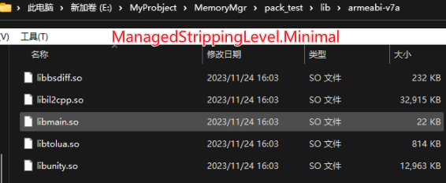
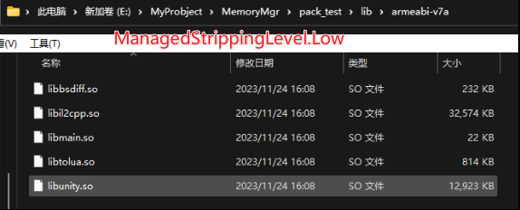

# Unity内存管理

## 内存分类

Unity按照内存管理方式分为：**引擎管理内存**和**用户管理内存**。引擎管理内存即引擎运行的时候自己要分配一些内存，例如很多的Manager和Singleton，这些内存开发者一般是碰触不到的。用户管理内存也就是我们开发者开发时使用到的内存，需要我们重点注意。

### 托管内存 Managed Memory

**Managed Memory的内存管理是自动的，会通过GC来释放。**

使用托管堆和[垃圾回收器](https://en.wikipedia.org/wiki/Garbage_collection_(computer_science))自动分配和分配内存的受控[内存](https://docs.unity.cn/cn/2021.3/Manual/performance-memory-overview.html#managed-memory)层。

脚本虚拟机（scripting virtual machine，VM）实现了托管内存系统（有时候也被叫做脚本内存系统）。VM 将托管内存分成了三个部分：

- 托管堆（managed heap）

- - 同 CLR 的托管堆一样，被垃圾回收器（GC）管理。

- 脚本栈（scripting stack）

- 原生 VM 内存（native VM memory）

- - 里面包含一些与生成的可执行代码相关的内存，比如泛型的使用，反射使用的类型的元数据。以及一些维持 VM 运行所需的内存。

### 非托管内存 Unmanaged Memory

C# 非托管内存层（C# unmanaged memory layer）允许你用 C# 的方式访问原生内存来微调（fine-tune）内存分配。

通过使用 `Unity.Collections` 域名空间下的数据结构，如 `NativeArray`，即可访问非托管内存。

如果使用 ESC 下的作业系统（Job system）和 Burst，则必须使用 C# 非托管内存。

### 本机内存 Native Memory

**Native Memory并不会被系统自动管理，需要我们手动去释放。**

Unity 用于运行引擎的 C++ 内存。在大多数情况下，用户是不能直接访问或者修改这部分内存的。

原生内存里面存储了项目中的场景、资源（assets，比如纹理、网格）、图形API、图形驱动、子系统、插件缓存以及其他的内存分配。用户通过封装的上层 C# 接口来间接访问和操作这些内存中的数据。

#### 优化Native Memory

优化Native Memory就是对Asset大小进行优化，以最合理的方式进行资源设置是优化Native Memory的关键。

##### Scene

导致Native Memory增长的原因，最常见的就是Scene。因为是c++引擎，所有的实体最终都会反映在c++上，而不会反映在托管堆上。所以当我们构建一个GameObject的时候，实际上在Unity的底层会构建一个或多个object来存储这一个GameObject的信息（Component信息等）。所以当一个Scene里面有过多的GameObject存在的时候，Native Memory就会显著的上升，甚至可能导致**内存溢出**。

<!--注：当我们发现Native Memory大量上升时，可以先着重检查我们的Scene。-->

##### Code Size

代码也是占内存的，需要加载进内存执行。**模板泛型的滥用**，会影响到Code Size以及打包速度（IL2CPP编译速度，单一一个cpp文件编译的话没办法并行的）。例如一个模板函数有四五个不同的泛型参数（float，int，double等），最后展开一个cpp文件可能会很大。因为实际上c++编译的时候我们用的所有的Class，所有的Template最终都会被展开成静态类型。因此当模板函数有很多排列组合时，最后编译会得到所有的排列组合代码，导致文件很大。

##### Managed code stripping代码裁剪

[托管代码剥离 - Unity 手册](https://docs.unity.cn/cn/current/Manual/ManagedCodeStripping.html)

在构建包体的过程会进行托管代码的裁剪过程，删除未使用或无法访问的代码，来减小包体的大小。包括从项目中的 C# 脚本生成的程序集、属于包和插件的程序集以及 .NET Framework 中的程序集。

```c#
BuildTarget buildTarget = EditorUserBuildSettings.activeBuildTarget;
            BuildTargetGroup buildTargetGroup = BuildPipeline.GetBuildTargetGroup(buildTarget);
PlayerSettings.SetManagedStrippingLevel(buildTargetGroup, ManagedStrippingLevel.Low);
```

注意有些类似反射的调用方式，在静态检测中检测为未使用，在裁剪等级高时会被裁剪掉。需要使用 [Preserve] 属性和 link.xml 文件进行标识，避免被裁剪。





##### AssetBundle

**TypeTree：**Unity前后有很多的版本，不同的版本中很多的类型可能会有数据结构的改变，为了做数据结构的兼容，会在生成数据类型序列化的时候，顺便生成一个叫**TypeTree**的东西。就是当前这个版本用到了哪些变量，它们对应的数据类型是什么，当进行反序列化的时候，根据TypeTree去做反序列化。如果上一个版本的类型在这个版本没有，那TypeTree里就没有它，所以不会去碰到它。如果有新的的TypeTree，但是在当前版本不存在的话，那要用它的默认值来序列化。从而保证了在不同版本之间不会序列化出错。

在Build AssetBundle的时候，有开关可以关掉TypeTree。

```text
BuildAssetBundleOptions.DisableWriteTypeTree
```

当我们当前AssetBundle的使用，和Build它的Unity的版本是一模一样的时候，就可以关闭。这样，一可以减少内存，二AssetBundle包大小会减少，三build和运行时会变快，因为不会去序列化和反序列化TypeTree。

### Untiy检测不到的内存

即Unity Profilter无法检查到的内存，例如用户分配的Native内存。比如自己写的Native插件（C++插件）导入Unity，这部分Unity是检测不到的，因为Unity没法分析已编译的C++是如何分配和使用内存的。还有就是**Lua**，它完全自己管理的，Unity也没法统计到它内部的情况。

## **Reserved/Used**

内存分页（IOS上大部分为16K/page）是内存管理的最小单位，当Unity需要申请内存的时候，都会以block的方式（若干个页）进行申请。如果某一页在若干次GC（IOS为8次）之后仍然为Empty的话，它就会被释放，实际的物理内存就会被还给物理内存。

但由于Unity是在虚拟内存中管理内存的，因此虚拟空间的地址并不会返还，所以它就变成“Reserved”的了。也就是说这些Reserved地址空间不能再被Unity重复分配了。

所以在一个32位的操作系统上，如果虚拟内存地址发生频繁分配和释放就会导致地址空间耗尽，从而被系统杀掉。

