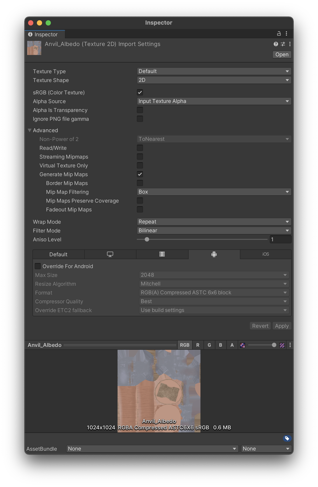

# Unity性能优化

## 第1节 静态资源优化

在Unity中的资源都存放在asset内，分为了外部导入资源和内部创建资源，无论是哪种资源都涉及到导入问题。在不同平台上合理的资源导入设置能够带来更高的效率。 

Unity在UPR下也提供了asset检测工具`Asset Check`。 

### Audio

当实现静音功能时，不要简单设置音量为0，应该销毁AudioSource组件，将音频从内存中卸载。

#### Force To Mono单声道

一些双声道资源两个声道的声音一致，或移动设备下听不出区别则可以开启来减少内存。

#### 压缩

我们应该尽可能使用未压缩的`WAV格式文件`作为源文件。通过不同平台支持的压缩格式进行压缩。

大部分移动平台下使用`Vorbis格式`进行压缩，如果音频不进行循环还可以使用`mp3格式`。

一些操作系统对特定的压缩格式有特定的优化，比如ios下的`mp3格式`。

对一些简短常用的音效还可以使用`ADPCM格式`，可能压缩比不是最好的但是在播放时解码速度快。

#### 采样率

我们还需要关注音频的采样率，采样率高音频大小也会随之变大。

在移动平台下一般设置为22050Hz，经验之谈。在移动平台下一般都会选择对音质影响最小的最低设置。

在`Sample Rate Setting`中选择复写采样频率。

#### 加载类型

不同的音乐类型推荐使用不同的加载类型。`Load Type`。

- Decompress On Load
  - 音频压缩后大小小于200kb
- Compressed In Memory
  - 音频压缩后大小大于200kb
- Streaming
  - 适合背景音，较长较大的音频。通过流加载，避免加载卡顿。

### Model

尽可能使用fbx格式。需要先对dcc工具进行导出设置。 

优化原始导入模型文件，删除不需要的数据

- 统一单位
- 导出的网格必须是多边形拓扑，不能是贝塞尔曲线、样条曲线、NURBS、NURMS、曲面细分等
- 烘培Deformers,在导出之前，确保变形体被烘培到网格模型上，如骨骼形变烘培到蒙皮权重上
- 不建议模型使用的纹理随模型导出
  - 会降低unity导入的模型导入效率，还会影响资源管理
- 如果需要导入Blend shape normals时，必须指定光滑组Smooth groups
  - 不是任何时候都需要导出光滑组，因为会损失细节
- 建议导出时不携带摄像机、灯光、材质等场景信息
  - 因为和unity的设置都不同，造成冗余

#### 原始模型影响性能点

前期尽量避免，后期比较难修改。

- 最小化面数，不需要微三角面，三角面尽量分布均匀
  - 微三角面指一个三角面只包含几个像素
- 合理的拓扑结果与平滑组，尽可能是闭包
  - 如果是几个单独面没有封闭，只是看起来是封闭的。那在unity烘焙的时候就会容易出错。
- 尽量少的材质个数
  - 材质数增多容易造成shader和贴图的爆炸
- 尽可能少的蒙皮网格
  - 尽量用相同的
- 尽可能少的骨骼数量
  - 过多骨骼动画容易造成CPU和GPU的性能瓶颈
- FK与IK节点没分离，IK节点没删除

#### 模型优化

- 尽可能的将网格合并到一起
- 尽可能使用共享材质
- 不要使用网格碰撞体
- 不必要不要开启网格读写
- 使用合理的LOD级别
- Skin Weights受骨骼影响个过多
- 合理压缩网格
- 不需要rigs和BlendShapes尽量关闭
- 如果可能，禁用法线或切线
- 多套模型

#### Unity导入设置

##### 模型设置

- Mesh Compression
  - 默认不开启，当确保网格正确时可以开启，可以让网格占用空间变小，但是运行时占用内存不变。
  - 开启后需要检查一遍，闭包比开放的模型出现概率更小
- Read/Write
  - 会多复制一份副本，一份副本在内存中，一份副本在显存中。需要动态修改时才开启。
- Optimize Mesh和Generate Colliders
  - 做网格级碰撞用的

### 纹理

#### 基础概念

应用于模型表面用于增加细节的位图图像。 纹理需要通过材质着色器映射才能到模型表面

##### 纹理类型

- **Default：**默认的纹理类型格式
- **Normal map：**法线贴图，可将颜色通道转换为适合实时法线贴图格式
- **Editor GUI and Legacy GUI：**在编辑器GUI控件上使用纹理请选择此类型
- **Sprite(2D and UI)：**在2D游戏中使用的精灵(Sprite)或UGUI使用的纹理请选择此类型
- **Cursor：**鼠标光标自定义纹理类型
- **Cookie：**用于光照Cookie剪影类型的纹理
- **Lightmap：**光照贴图类型的纹理，编码格式取决于不同的平台
- **Single Channel：**如果原始图片文件只有一个通道，请选择此类型

##### 纹理大小

纹理大小最好是2的幂次方。纹理大小直接影响内存和显存占用的大小，同时也会对GPU采样、CPU加载带宽造成影响。

选择合适纹理大小应尽量遵循以下经验：

- 不同平台、不同硬件配置选择不同的纹理大小，Unity下可以采用bundle变体设置多套资源、通过Mipmap限制不同平台加载不同level层级的贴图。
- 根据纹理用途的不同选择不同的纹理加载方式，如流式纹理加载Texture Streaming、稀疏纹理Sparse Texture、虚拟纹理VirtualTexture等方式。
- 不能让美术人员通过增加纹理大小的方式增加细节(容易造成内存爆炸)，可以选择细节贴图DetailMap或增加高反差保留的方式。
- 在不降低视觉效果的情况下尽量减小贴图大小，最好的方式是纹理映射的每一个纹素的大小正好符合屏幕上显示像素的大小，如果纹理小了会造成欠采样，纹理显示模糊，如果纹理大了会造成过采样，纹理显示噪点。这一点做到完美平衡很难保障，可以充分利用Unity编辑器下SceneView->DrawMode->Mipmap来查看在游戏摄像机视角下哪些纹理过采样，哪些纹理欠采样，进而来调整纹理大小。

##### 纹理颜色空间

 默认大多数图像处理工具都会使用sRGB颜色空间处理和导出纹理。但如果你的纹理不是用作颜色信息的话，那就不要使用sRGB空间，如金属度贴图、粗糙度贴图、高度图或者法线贴图等。一旦这些纹理使用sRGB空间会造成视觉表现错误。

##### 纹理压缩

 纹理压缩是指图像压缩算法，保持贴图视觉质量的同时，尽量减小纹理数据的大小。默认情况下我们的纹理原始格式采用PNG或TGA这类通用文件格式，但与专用图像格式相比他们访问和采样速度都比较慢，无法通用GPU硬件加速，同时纹理数据量大，占用内存较高。所以在渲染中我们会采用一些硬件支持的纹理压缩格式，如ASTC 、ETC、ETC2、DXT等。

 如下图为未压缩、ETC2、ASTC6x6三种格式文件大小对比，我们可以看到在质量相差不大的情况下ASTC6x6压缩下大小可以减少到接近未压缩的十分之一。

##### 纹理图集

纹理图集是一系列小纹理图像的集合，

- 优点：

 一是采用共同纹理图集的多个静态网格资源可以进行静态合批处理，减少DrawCall调用次数。

 二是纹理图集可以减少碎纹理过多，因为他们打包在一个图集里，通过压缩可以更有效的利用压缩，降低纹理的内存成本和冗余数据。

- 缺点

 美术需要合理规划模型，并且要求模型有相同的材质着色器，或需要制作通道图去区分不同材质。制作和修改成本较高。

##### 纹理过滤

- **Nearest Point Filtering：**临近点采样过滤最简单、**计算量最小**的纹理过滤形式，但在近距离观察时，纹理会呈现块状。
- **Bilinear Filtering：**双线性采样过滤会对临近纹素采样并插值化处理，对纹理像素进行着色。双线性过滤会让像素看上去平滑渐变，但近距离观察时，纹理会变得模糊。
- **Trilinear Filtering：**三线性过滤除与双线性过滤相同部分外，还增加了Mipmap等级之间的采样差值混合，用来平滑过度消除Mipmap之间的明显变化。
- **Anisotropic Filtering：**各向异性过滤可以改善纹理在倾斜角度下的视觉效果，跟适合用于地表纹理。

##### 纹理Mipmap

- Mipmap纹理

 逐级减低分辨率来保存纹理副本。相当于生成了纹理LOD，渲染纹理时，将根据像素在屏幕中占据的纹理空间大小选择合适的Mipmap级别进行采样。渲染具有mipmap对象时，当摄像机离对象较远时将采用较低分辨率的纹理，当摄像机离对象较近时采用较高分辨率的纹理。

- 优点：

 GPU不需要在远距离上对对象进行全分辨率纹理采样，因此可以**提高纹理采样性能。**

 同时也解决了远距离下的过采样导致的噪点问题，提高的纹理渲染质量。

- 缺点：

 由于Mipmap纹理要生成低分辨率副本，会造成额外的内存开销。

#### 导入设置

##### Texture Shape

- 2D 最常用的2D纹理，默认选项
- Cube 一般用于天空和与反射探针，默认支持Default、Normal、Single Channel几种类型纹理，可以通过Assets > Create > Legacy > Cubemap生成，也可以通过C#代码 Camera.RenderToCubemap在脚本中生成
- 2D Array 2D纹理数组，可以极大提高大量相同大小和格式的纹理访问效率，但需要特定平台支持，可以通过引擎SystemInfo.supports2DArrayTextures 接口运行时查看是否支持。
- 3D 通过纹理位图方式存储或传递一些3D结构话数据，一般用于体积仿真，如雾效、噪声、体积数据、距离场、动画数据等信息，可以外部导入，也可运行时程序化创建。

##### Alpha Source

默认选择Input Texture Alpha就好，如果确定不使用原图中的Alpha通道，可以选择None。另外From Gray Scale我们一般不会选用

##### Alpha Is Transparency

指定Alpha通道是否开启半透明，如果位图像素不关心是否要半透明可以不开启此选项。这样Alpha信息只需要占1bit。节省内存

##### Ignore Png file gamma

是否忽略png文件中的gamma属性，这个选项是否忽略取决于png文件中设置不同gamma属性导致的显示不正常，一般原图制作流程没有特殊设置，这个选项一般默认就好。

##### Read/Write

开启此选项会导致内存量增加一倍，默认我们都是不开启，除非你的脚本逻辑中需要动态读写该纹理时需要打开此选项。

##### Streaming Mipmaps(Texture Streaming部分讲解)

##### Virtual Texture Only(虚拟部分讲解)

###### Generate Mip Maps

**什么时候不需要生成MipMaps？**

1. 2D场景
2. 固定视角，摄像机无法缩放远近

- Border Mip Maps 默认不开启，只有当纹理的是Light Cookies类型时，开启此选项来避免colors bleeding现象导致颜色渗透到较低级别的Mip Level纹理边缘上
- MipMap Filtering
- Box 最简单，随尺寸减小，Mipmap纹理变得平滑模糊
- Kaiser，避免平滑模糊的锐化过滤算法。
- Mip Maps Preserve Coverage，只有需要纹理在开启mipmap后也需要做Alpha Coverage时开启。默认不开启。
- Fadeout MipMaps, 纹理Mipmap随Mip层级淡化为灰色，一般不开启，只有在雾效较大时开启不影响视觉效果。

###### 选择合适纹理过滤的最佳经验：

- 使用双线性过滤平衡性能和视觉质量。
- 有选择地使用三线性过滤，因为与双线性过滤相比，它需要更多的内存和带宽。
- 使用双线性和 2x 各向异性过滤，而不是三线性和 1x 各向异性过滤，因为这样做不仅视觉效果更好，而且性能也更高。
- 保持较低的各向异性级别。仅对关键游戏资源使用高于 2 的级别。

###### 其他可能有问题的纹理类型

- 纹理图集大小设置不合理，图集利用率低
- 大量只有颜色差异的图片
- UI背景贴图而不采用9宫格缩放的图
- 纯色图没有使用Single Channel
- 不合理的半透明UI，占据大量屏幕区域，造成Overdraw开销
- 大量2D序列帧动画，而且图片大，还不打图集
- 不合理的通道图利用方案
- 大量渐变色贴图，没有采用1像素过渡图，也不采用Single Channel, 粒子特效中较为常见。