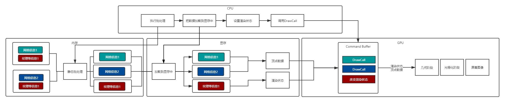
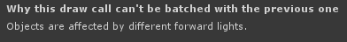
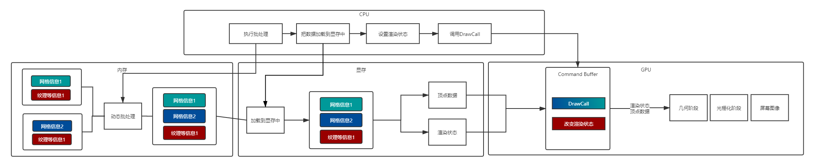
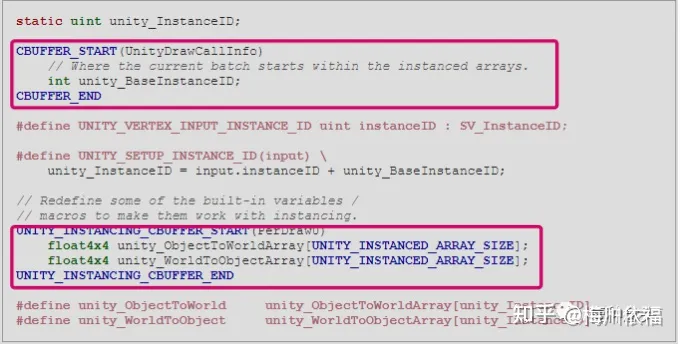
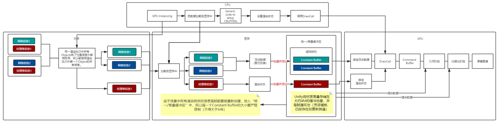
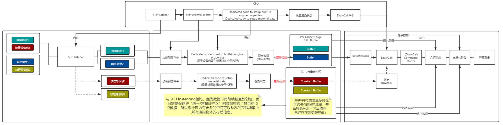

# Unity渲染中的四种批处理

批处理实际是通过减少DrawCall消耗的方式来优化CPU时间。

#### 静态批处理

**静态合批牺牲了大量的内存和带宽，以使得合批工作能够快速有效的进行。**

在Runtime时`不移动不旋转不缩放的物体`可视为静态物体，在Inspector面板勾选`Batching Static`标记为静态物体，在材质相同时静态物体可以被`静态批处理`。

在项目Build时，提取静态物体的Vertex buffer和Index buffer。根据静态物体其在场景中的最终状态信息，将模型的顶点数据转换到世界坐标下。存储在新构建的大Vertex buffer和Index buffer中。记录每一个子模型的IndexBuffer数据在构建大的IndexBuffer的起始以及结束位置。

由于在静态合批的过程中进行了顶点转换，所以cpu不需要执行顶点转换从而更快的渲染它们，但是不会减少DrawCall数量（但在编辑器显示上减少）。

##### 注意事项

`Static batching`会导致包体大小增加，Runtime时占用的内存大小也会增加。

开启`Static batching`，在Unity执行Build的时候，场景中所有引用相同模型的GameObject都必须将模型顶点信息复制，并经过计算变化到最终在世界空间中，存储在最终生成的Vertex buffer中。这就导致了打包的体积及运行时内存的占用增大。例如，树林场景如果树被标记为静态则会严重影响内存。

###### **相同材质批处理断开情况**

1. 位置不相邻且中间夹杂着不同材质的其他物体，不会进行同批处理，这种情况比较特殊，涉及到批处理的顺序。
2. 拥有lightmap的物体含有额外（隐藏）的材质属性，比如：lightmap的偏移和缩放系数等。所以，拥有lightmap的物体将不会进行同批处理（除非他们指向lightmap的同一部分）

##### 处理流程



#### 动态批处理

**动态合批为了平衡CPU消耗和GPU性能优化，将实时合批条件限制在比较狭窄的范围内。**

只有当`Dynamic Batching`产生的CPU开销小于DrawCall的开销，`Dynamic Batching`才具有性能优化的效果。新一代图形API（ Metal、Vulkan）在批次间的消耗降低了很多，所以在这种情况下使用Dynamic batching很可能不能获得性能提升。

Unity在Runtime会对`视野中`，`材质相同`并且符合条件的动态模型在场景绘制之前，将所有同一材质的模型的顶点数据转换到世间空间中，然后通过一个DrawCall中绘制。

**模型顶点变换的过程是通过CPU完成的，所以会有CPU消耗，并且一次计算的模型顶点数量不宜过多，否者CPU串行计算耗时太长会造成场景渲染卡顿。所以`Dynamic Batching`只能处理一些小模型。**

##### **无法参与批处理情况**

1. 物件Mesh大于等于900个面。
2. 代码动态改变材质变量后不算同一个材质，会不参与合批。
3. 如果你的着色器使用顶点位置，法线和UV值三种属性，那么你只能批处理300顶点以下的物体；如果你的着色器需要使用顶点位置，法线，UV0，UV1和切向量，那你只能批处理180顶点以下的物体，否则都无法参与合批。
4. 改变Renderer.material将会造成一份材质的拷贝，因此会打断批处理，你应该使用Renderer.sharedMaterial来保证材质的共享状态。

##### **批处理中断情况**

1. 位置不相邻且中间夹杂着不同材质的其他物体，不会进行同批处理，这种情况比较特殊，涉及到批处理的顺序。

2. 物体如果都符合条件会优先参与静态批处理，再是GPU Instancing，然后才到动态批处理，假如物体符合前两者，此次批处理都会被打断。

3. GameObject之间如果有镜像变换不能进行合批，例如，"GameObject A with +1 scale and GameObject B with –1 scale cannot be batched together"。

4. 拥有lightmap的物体含有额外（隐藏）的材质属性，比如：lightmap的偏移和缩放系数等。所以，拥有lightmap的物体将不会进行批处理（除非他们指向lightmap的同一部分）。

5. 使用Multi-pass Shader的物体会禁用Dynamic batching，因为Multi-pass Shader通常会导致一个物体要连续绘制多次，并切换渲染状态。这会打破其跟其他物体进行Dynamic batching的机会。

6. 我们知道能够进行合批的前提是多个GameObject共享同一材质，但是对于Shadow casters的渲染是个例外。仅管Shadow casters使用不同的材质，但是只要它们的材质中给Shadow Caster Pass使用的参数是相同的，他们也能够进行Dynamic batching。

7. Unity的Forward Rendering Path中如果一个GameObject接受多个光照会为每一个per-pixel light产生多余的模型提交和绘制，从而附加了多个Pass导致无法合批，如下图:

   

##### 处理流程



#### GPUInstancing

`GPU Instancing`与动态和静态合批不同的是，`GPU Instancing` 并不通过对网格的合并操作来减少Drawcall，`GPU Instancing `的处理过程是只提交一个模型网格让GPU绘制很多个地方，这些不同地方绘制的网格可以对缩放大小，旋转角度和坐标有不一样的操作，材质球虽然相同但材质球属性可以各自有各自的区别。

Unity会在运行时对于**正在视野中**的符合要求的所有对象使用[**Constant Buffer**](https://zhuanlan.zhihu.com/p/98642798#ref_5)将其位置、缩放、uv偏移、*lightmapindex*等相关信息保存在显存中的[**“统一/常量缓冲器”**](https://zhuanlan.zhihu.com/p/98642798#ref_6)中，然后从中抽取一个对象作为实例送入渲染流程，当在执行DrawCall操作后，从显存中取出实例的部分共享信息与从GPU常量缓冲器中取出对应对象的相关信息一并传递到下一渲染阶段，与此同时，不同的着色器阶段可以从缓存区中直接获取到需要的常量，不用设置两次常量。比起以上两种批处理，`GPU Instancing`可以**规避合并Mesh导致的内存与性能上升**的问题，但是由于场景中所有符合该合批条件的渲染物体的信息每帧都要被重新创建，放入“统一/常量缓冲区”中，而碍于缓存区的大小限制，每一个Constant Buffer的大小要严格限制（不得大于64k）。

从图形调用接口上来说 GPU Instancing 调用的是 OpenGL 和 DirectX 里的多实例渲染接口。我们拿 OpenGL 来说:

```glsl
void glDrawArraysInstanced(GLenum mode, GLint first, GLsizei count, Glsizei primCount);

void glDrawElementsInstanced(GLenum mode, GLsizei count, GLenum type, const void* indices, GLsizei primCount);

void glDrawElementsInstancedBaseVertex(GLenum mode, GLsizei count, GLenum type, const void* indices, GLsizei instanceCount, GLuint baseVertex);
```

这三个接口正是 GPU Instancing 调用OpenGL多实例渲染的接口，第一个是无索引的顶点网格集多实例渲染，第二个是索引网格的多实例渲染，第三个是索引基于偏移的网格多实例渲染。这三个接口都会向GPU传入渲染数据并开启渲染，与平时渲染多次要多次执行整个渲染管线不同的是，这三个接口会分别将模型渲染多次，并且是在同一个渲染管线中。

如果只是一个坐标上渲染多次模型是没有意义的，我们需要将一个模型渲染到不同的多个地方，并且需要有不同的缩放大小和旋转角度，以及不同的材质球参数，这才是我们真正需要的。GPU Instancing 正为我们提供这个功能，上面三个渲染接口告知Shader着色器开启一个叫 InstancingID 的变量，这个变量可以确定当前着色计算的是第几个实例。

有了这个 InstancingID 就能使得我们在多实例渲染中，辨识当前渲染的模型到底使用哪个属性参数。Shader的顶点着色器和片元着色器可以通过这个变量来获取模型矩阵、颜色等不同变化的参数。

##### 使用限制

当你使用GPU instancing时，受到下面的限制约束:

- Unity自动为instancing调用选择MeshRenderer组件和`Graphics.DrawMesh`。注意不支持[SkinnedMeshRenderer](https://link.zhihu.com/?target=https%3A//docs.unity3d.com/ScriptReference/SkinnedMeshRenderer.html)。
- 在一次GPU instancing draw call中，Unity仅对共享相同Mesh和相同Material的GameObjects进行batching处理。为了得到更好的instancing效果，尽量使用少量Meshes和Materials。至于如何增加“变化”(variations)，可以在你的shader代码中添加per-instance数据(更多细节，请继续往下看)。

你也可以在c#脚本中调用[Graphics.DrawMeshInstanced](https://docs.unity3d.com/ScriptReference/Graphics.DrawMeshInstanced.html)和[Graphics.DrawMeshInstancedIndirect](https://docs.unity3d.com/ScriptReference/Graphics.DrawMeshInstancedIndirect.html)来完成GPU instancing。

##### 无法参与加速的情况

1. 缩放为负值的情况下，会不参与加速。
2. 代码动态改变材质变量后不算同一个材质，会不参与加速，但可以通过将颜色变化等变量加入常量缓冲器中实现。
3. 受限于常量缓冲区在不同设备上的大小的上限，移动端支持的个数可能较低。
4. 只支持一盏实时光，要在多个光源的情况下使用实例化，我们别无选择，只能切换到延迟渲染路径。为了能够让这套机制运作起来，请将所需的编译器指令添加到我们着色器的延迟渲染通道中。

##### **批处理中断情况**

###### 位置不相邻

位置不相邻且中间夹杂着不同材质的其他物体，不会进行同批处理，这种情况比较特殊，涉及到批处理的顺序，我的另一篇文章有详解。

###### **单批次最多实例化511个**

一个批次超过511个物体(D3D)\128个物体(OpenGL)（受限于常量缓冲区在不同设备上的大小的上限，移动端数量有浮动）的时候会新建另一个加速流程。

一个批次可实例化物体的数量受限于常量缓存区(constant buffers)，D3D一般为64k，OpenGL一般为16k。



以上两个矩阵，每个矩阵使用4*(float的size)*4(四行)*4（四列） = 64byte 两个矩阵为128byte

constant Buffer 为64KB = 65536 byte

65536btte/128byte = 512个对象

但一个Unity_BaseInstanceID为4个byte, 所以512个对象少一个刚好511

以上是为什么显示511个对象的问题，其实在OpenGL上constant Buff只是16K， 这样推理少了4倍那手机应该为127个对象。

###### 静态批处理打断GPU Instancing

物体如果都符合条件会优先参与静态批处理，然后才到GPU Instancing，假如物体符合前者，此次加速都会被打断。



###### 

#### SRP Batcher

`SRP Batcher` 并不会减少 DrawCall，减少是 DrawCall 之间的 GPU 设置的工作量。

<!--因为 Unity 在发出 DrawCall 之前必须进行很多设置。实际的 CPU 成本便来自这些设置，而不是来自 GPU DrawCall 本身（DrawCall 只是 Unity 需要推送到 GPU 命令缓冲区的少量字节）。-->

SRP Batcher 通过批处理一系列 Bind 和 Draw GPU 命令来减少 DrawCall 之间的 GPU 设置的工作量。也就是之前一堆绑定和绘制的 GPU 命令，我们可以使用批处理减少绘制调用之间的 GPU 设置。

##### 使用条件(兼容性)

只能在高清渲染管线(HDRP) 和 通用渲染管线(URP)中使用

###### Shader兼容性

- shader必须在名为UnityPerDraw的常量缓冲区中声明所有的内置引擎 properties。 举例, unity_ObjectToWorld， 或者unity_SHAr。
- shader必须在名为UnityPerMaterial的常量缓冲区中声明所有material properties。

##### **SRPBatcher** **的应用**

- 应用1：

- - 常规优化手段，对于场景中大量存在且表现相同的物体会采用合并 Mesh 减少 DrawCall 的方式（静态批），而对于多种需要不同材质表现则无法合并，因为他们使用的不是同一个材质球。
  - 而 SRPBatcher 则可以批处理这些 Shader （使用的变体也相同）相同的物体。

- 应用2：

  - 直接使用 StaticBatcher 它内存消耗很高的情况下，在内存瓶颈的情况下，可以考虑使用 **SRPBatcher +** StaticBatcher 混用，进行内存优化。（但是要注意，在场景的复杂度很高的情况下，大概率会出现 drawcall 大幅度提升，导致帧率陡降。）


##### 批处理中断情况

位置不相邻且中间夹杂着**不同Shader**，或者**不同变体**的其他物体，不会进行同批处理，这种情况比较特殊，涉及到批处理的顺序，我的另一篇文章有详解。

##### 处理流程

