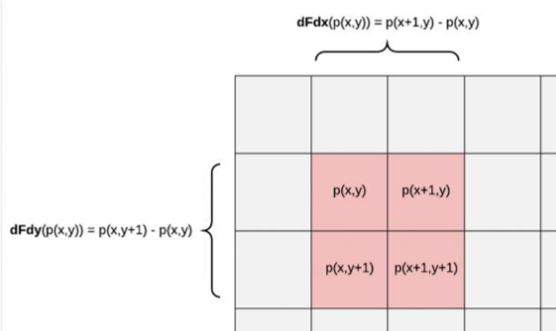
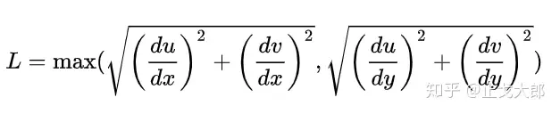
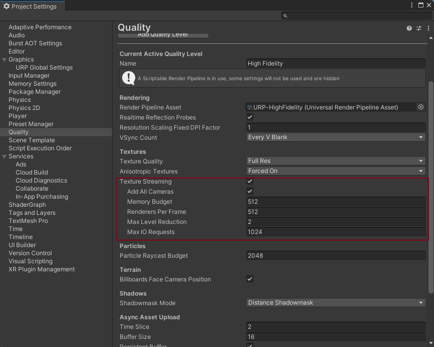
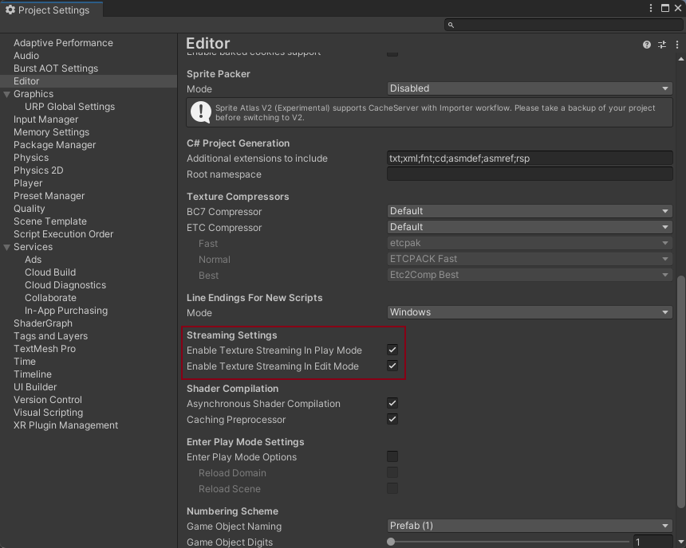

# 浅谈Mipmap

Mipmap的作用是解决模型远处纹理过采样所导致的摩尔纹现象，过采样实际是Pixel和Texel实际尺寸不匹配导致的。

Mipmap会逐级减低分辨率来保存纹理副本。相当于生成了纹理LOD，渲染纹理时，将根据像素在屏幕中占据的纹理空间大小选择合适的Mipmap级别进行采样。**当一个Texture开启Mipmap后，其占用内存会增加33%。**

Mipmap只对3D物体生效，随着物体的z值变化来选择合适的Mipmap等级。

什么时候不需要开启Mipmap？

- UI物体
- 固定视角，摄像机无法缩放远近

## Mipmap各级别尺寸

可以把Mipmap理解成是一个TextureArray，包含着各个级别尺寸的Texture。每一级别的宽高都是上一个级别的1/2，也就是说面积为上一个级别的1/4。

举个例子，一张 1024 * 1024 的纹理，生成 Mipmap 后，会新产生 512 * 512，256 * 256，128 * 128，64 * 64，32 * 32，16 * 16，8 * 8，4 * 4，2 * 2，1 * 1 这几张不同纹理级别的纹理。

可以手动计算一下，新产生的纹理大小总和是 349525 个像素，而原来的 1024 * 1024 纹理有 1048576 个像素，349525 / 1048576 约等于 0.33333302，也就是大约 1/3。

## GPU如何对Mip级别进行采样

1. 当渲染一个使用Mipmap纹理的物体时，CPU会先从磁盘中把该Texture**所有的Mip等级都加载到显存中**。
2. 当GPU对纹理进行采样时，它会**根据当前像素的纹理坐标 （UV） 以及 GPU 计算的两个内部值（DDX 和 DDY）确定要使用的 mip 级别。**DDX 和 DDY 提供有关当前像素旁边和上方像素的 UV 的信息，包括距离和角度。

GPU 使用这些值来确定相机可以看到多少纹理细节。当前像素与其相邻像素之间的距离越远，角度越极端，意味着 GPU 会选择分辨率较低的 mip;较短的距离和较少的极端角度意味着 GPU 选择具有更高分辨率的 MIP。

GPU 还可以将来自两个 Mips 的纹理信息与三线性滤波混合在一起。在采样时混合 mip 可以使从一个 Mip 到另一个 Mip 的过渡不那么明显。为了混合 Mip，GPU 从一个 mip 中获取特定百分比的纹理信息，并从另一个 mip 中获取其余信息。所以在渲染物体的时候才需要加载所有的Mip等级。

### 纹理元素Texel

纹素是纹理图形的基本单位，用于定义三维对象的曲面；3D 对象曲面的基本单位是纹理，而 2D 对象由像素（Pixel）组成；

纹素代表了映射到三维表面的二维纹理的最小单元，纹素和像素很相似因为都代表了图像的基础单元，但是在贴图中的纹素和图片中的像素在显示的时候是有区别的。

包含3D纹理的对象 靠近相机时纹素看起来较大，每个纹素可能包含多个像素。而相同的纹理对象 远看时，纹理图案越来越小，每个纹素可能小于像素，一个像素包含多个纹素，这个像素的颜色显示就需要对多个纹素的颜色进行混合。

### DDX和DDY

ddx，ddy的作用是分别计算屏幕空间中x轴向和y轴向的给定值的偏导。

**在光栅化阶段**，GPUs会在同一时刻并行运行很多Fragment Shader，但是并不是一个pixel一个pixel去执行的，而是将其组织在2x2的一组pixels分块中，去并行执行。

偏导数就正好是计算的这一块像素中的变化率。ddx 就是右侧的像素对应的fragment的x坐标减去左侧的像素对应的fragment的x坐标；而ddy就是下侧像素对应的fragment的坐标y减去上侧像素对应的fragment的坐标y。其中的x，y代表的是屏幕坐标。

使用模型表面的UV作为参数，使用ddx和ddy求其偏导，就可以得到在纹理空间下，相邻屏幕像素的UV差值，显而易见，相邻像素的UV差值越大，说明采样的纹理在屏幕上占比越小，对应的就需要使用mipmap level更大的mipmap等级进行纹理采样。(**原本0-1的UV可以铺满1000x1000的屏幕，相邻像素点UV差值为0.001=1/1000，当只能铺满1/4屏幕，也就是500x500的屏幕时，相邻像素点UV差值为0.002=1/500**)。

Mip Level 计算公式：

## 纹理串流Texture Streaming

### Mipmap加载

**一张Texture具有0 ~ n级Mip，开启Texture Streaming之后，如果Unity计算出的Mip等级为x，则Unity会将该Texture的x ~ n级Mip都加载到显存中，也可以理解为丢弃掉0 ~ (x-1)级Mip**。（**在后文中所说加载Mip等级x，意思都是加载Mip等级x ~ n**）

对于使用开启Mipmap的纹理的一个GO，我们不一定只会用到1张Mip，因为如果GO是一个长条型，远处的像素可能还是会使用更高等级的Mip。只是说Texture Streaming System会把**必不可能用到的几个低等级的Mip**丢弃，不加载到显存中（或者从显存中卸载）。

### TextureStreaming加载

在开启Texture Streaming后，显存中只会存储需要加载的Mipmap Level。

1. 当渲染一个使用Mipmap纹理的GO时，CPU将最低Mipmap等级的Mip**异步加载**到显存中。
2. GPU先使用这些低级Mipmap渲染GO。
3. cpu计算出该GO必不可能用到mip等级，比如计算出x意味着只可能会用到x+1 ~ n级Mip，将x+1 ~ n级Mip加载到显存中。
4. 当GPU对纹理进行采样时，它会根据当前像素的纹理坐标和GPU计算的两个内部值DDX和DDY来确定要使用的Mipmap等级，也就是根据像素在场景中覆盖的实际大小找到与之匹配的Texel大小，根据该Texel大小决定要使用的Mip等级。补充说明，DDX和DDY提供有关当前像素旁边和上方像素的UV的信息，包括距离和角度，GPU使用这些值来确定有多少纹理细节对相机可见。

### 纹理异步加载 AUP

使用Texture Streaming的好处就在于可以使用AUP，加载物体时会先异步加载较高等级的mip，让物体先渲染出来，之后再使用较低等级的mip，来展示高精度的纹理细节。表现上则是先模糊再清晰。

### 使用Texture Streaming

参数如下：

- `Add All Cameras` —— 是否对项目中的所有摄像机开启纹理串流。（默认开启）
  - 如果关闭 All Cameras，那么则需要对相机进行单独设置，给摄像机添加`Streaming Controller`组件，还可以设置该相机的mip偏移。
  - 这个参数实际应该默认关闭的，因为UICamera不需要开启纹理串流
- `Memory Budget `—— 设置开启纹理串流时，加载的纹理内存最大值。（默认512MB）
  - 默认512MB，但是对于一般的手机项目而言，设置为200MB左右比较合适
  - 当Texture内存占用超过了`Memory Budget`时，Unity会自动丢弃没有使用到的mipmaps，`Max Level Reduction`控制丢弃的mipmaps。
  - 当纹理内存超过预算时，会从远到近
- `Renderers Per Frame` —— 设置CPU每帧纹理串流系统处理多少个Renderers（即对于一个Renderer，在CPU端计算出需要传递哪几级Mipmap并传递给显存）。该值较低时会降低每帧CPU处理纹理串流的压力，但会增加Unity加载mipmap的延迟。
- `Max Level Reduction` —— 设置当超过纹理预算时纹理串流能丢弃的最大mipmap数。（默认是2，意味着最多丢弃2张最低级的mipmap）同时，这个值也决定了纹理初始化加载时会加载max level reduction级的mipmap。
  - `Max Level Reduction`决定了最大加载的Mipmap等级
  - `Max Level Reduction`也代表Mipmap Streaming System初始化加载Texture时加载的Mip等级。
- `Max IO Requests` —— 设置纹理串流系统的纹理文件IO请求的最大数量。（默认是1024）

### 让纹理支持Mipmap Streaming

在Texture Import Setting重勾选 `Streaming Mipmaps`

**Mip Map Priority**属性，该属性表示该纹理在Mipmap Streaming System中分配资源的优先级。Priority值越大，优先级越高，其范围为[-128,127]。

### 配置启用环境

在Unity中还有个比较深的设置，可能会导致Mipmap无法呈现出效果。

### **Texture Streaming System管理策略**

1. 当Non Streamed Texture（未开启Mipmap Streaming的Texture）需要被加载时，其会被完全加载到内存中，如果加载的Texture具有Mipmap 0 ~ n，则Mipmap 0 ~ n都会被加载到内存中。
2. 在加载Scene时，如果Budget足够，Scene中的GO所使用的Texture会完全加载，即加载Mipmap 0 ~ n级；如果Budget不足，则按Max Level Reduction加载。
3. 动态加载的GO Texture在Load和Instantiate时（在此时可能并未实际渲染该物体），Unity会始终首先加载其Max Level Reduction级的Mipmap到内存中，这样做的好处是加载速度会变快，因为只需要加载一个Mipmap等级，占用的内存会少，另外Texture Streaming System会为其使用纹理异步加载。
4. 在我们实际需要渲染GO时（当Instantiate GO后，我们可能需要立刻渲染该物体，或者该物体Active后出现在摄像机内等等情况），CPU会按照当前空闲的纹理串流预算和摄像机和物体之间的距离等等因素去计算当前需要加载的Mipmap等级。如果Budget足够，则加载计算出的Mipmap等级；如果Budget不足，则依然加载Max Level Reduction级别的Mipmap。
5. 在运行时，当我们需要加载一个新的Texture且当前纹理占用内存超过了预算，Texture Streaming System会想办法开始减少Texture占用的内存。对于Scene自带的所有GO，Unity会以距离摄像机从远到近的顺序重新计算来判断其是否真正需要加载当前其Mipmap等级，如果不需要则会卸载其过高的Mipmap等级，以此给出内存空间给到新加载的Texture。此时，对于需要加载的新Texture，如果其计算出的Mipmap等级可以加载（即空闲内存足够）则加载其计算出来的Mipmap等级；如果不能加载（在按策略卸载部分GO不需要的Mipmap后，内存还是不够），则加载Max Level Reduction级别的Mipmap。从这一点也可以看出，对于一个Texture，其实际加载的最大Mipmap等级就是Max Level Reduction（即使会超出Budget也会加载这一等级）。

### Mipmap偏移 MipmapBias

在实际项目中，需要对不同性能的机型使用Mipmap偏移。

有几种设置Mipmap偏移的方式：

- **QualitySettings.masterTextureLimit**
  - 其默认值为0，将其值设置为x，有没有开启`Texture Streaming`都会生效，使用第x级Mipmap。
  - 通过`QualitySettings.masterTextureLimit`设置的偏移会将低等级Mip从显存中卸载，达到内存优化的效果。
- **Texture.mipMapBias**
  - 设置单个Texture的Mipmap偏移，有没有开启`Texture Streaming`都会生效
- **Streaming Controller组件上的Mip Map Bias**
  - 只在QualitySettings.AddAllCamera未启用，且在Camera上激活Streaming Controller时起作用。
  - 只对开启了`Texture Streaming`的Texture生效

**MipmapBias会在Mipmap Streaming System计算Mip等级的时候才生效**（在Texture.streamingTextureDiscardUnusedMips开启后会实时生效

## 在Shader中Debug

`Texture.SetStreamingTextureMaterialDebugProperties`

在C#中进行调用，那么在Shader中就可以获取到mipmap的信息。

在shader中，纹理开启mipmap后都会有一个mipInfo的属性。假设纹理命名为`MainTex`，它会设置一个名为`MainTex_MipInfo`的属性。

此属性在其 x、y、z 和 w 字段中表示

- x —— 系统设置的maxReductionLevel
- y —— 纹理的mip总数
- z —— 纹理串流系统计算出应该使用的纹理Mip等级
- w —— 当前加载的Mip等级

## 常用API

### QualitySetting

- QualitySettings.streamingMipmapsActive
- QualitySettings.streamingMipmapsAddAllCameras 
- QualitySettings.streamingMipmapsMemoryBudget
- QualitySettings.streamingMipmapsMaxLevelReduction
- QualitySettings.masterTextureLimit

### Texture

- Texture.streamingTextureDiscardUnusedMip
  - 会序列化到本地
- Texture.currentTextureMemory
- Texture.SetStreamingTextureMaterialDebugProperties(); —— 在Shader中会给每个开启Mipmap的纹理赋值一个MipInfo
- Texutre.mipMapBias —— 设置单个纹理偏移值

## 总结

- 把Mipmap等级看做是一个纹理采样的区间范围，`当前Mip等级`~`Max Level Reduction`，GPU会根据DDX和DDY在这个区间内选择一个合适的mipmap进行采样的。