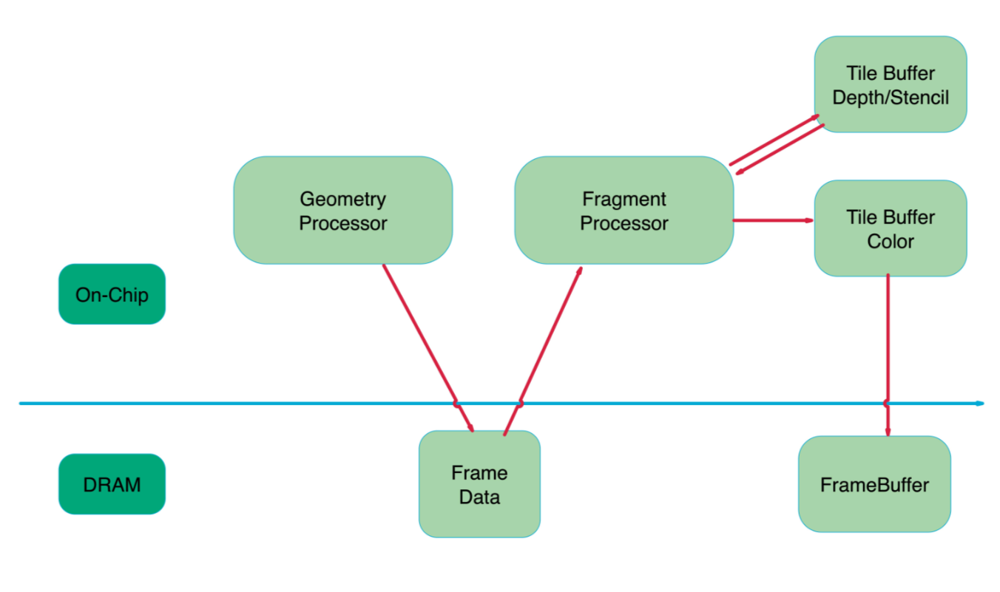
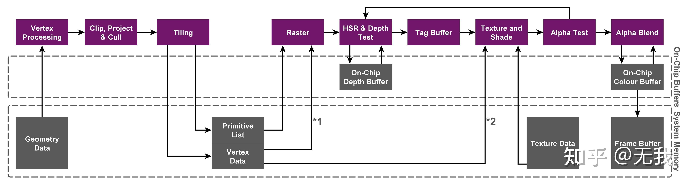
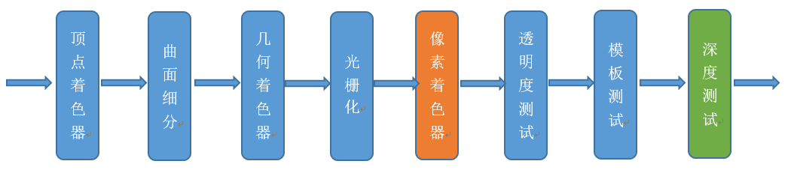
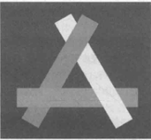

# 浅谈TBR和TBDR

# X86和ARM

在PC设备上一般为X86架构，在移动端设备上架构则大多是ARM架构，在早期的摩托罗拉手机还存在一些X86架构的移动端芯片不过这里可以完全忽略，视为移动端只有ARM架构即可。

在X86架构中，GPU拥有独立的显存空间，CPU也有独立的内存空间。当CPU调用DrawCall时，CPU会把数据通过总线从内存传递到显存中。CPU访问内存速度很快，GPU访问显存的速度也很快，但是内存传递到GPU的这个过程没那么快。所以才需要优化DrawCall的数量避免带宽传递带来的消耗。

而在ARM架构中，CPU、GPU、内存、总线、基带这些东西都被整合在了一个芯片内称之为SOC。所以在ARM架构中，CPU和GPU使用的内存其实是在同一个物理内存颗粒上的，但GPU有逻辑上独立的内存区间。这块内存区间是GPU驱动来管理的。

在之前的OpenGL ES规范中CPU和GPU之间的内存是不能共享的，Vertex和Texture的Buffer是需要拷贝的，即使是在同一物理内存上。现在有了vulkan，openGL和openGL ES可以和CPU之间共享内存了，不用象以前那样拷贝来拷贝去了，当然vulkan还有其他很有用的特性。

# GPU架构

## IMR

IMR的全称为Immediate Mode Rendering通常称为即时模式架构，在PC上基本使用X86架构所以是有独立显存的。PC端的GPU一般是IMR架构。

在IMR架构中，每一次渲染完的Color和Depth数据写回到Frame Buffer和 Depth Buffer都会产生很大的带宽消耗。但是IMR架构中也会有L1和L2之类的Cache来优化这部分大量的带宽消耗。

IMR牺牲了带宽功耗换来了执行效率。

## TBR

VS - Defer - RS - PS

IMR架构带来的带宽消耗在移动端上是无法接受的，功耗意味着耗电量，其中功耗消耗最大的就是带宽，所以在移动端上的GPU基本采用TBR/TBDR架构。

TBR相比于IMR优化带宽消耗的方式就是缓存机制。既然移动端没有显存的概念，那么移动端的GPU又是怎么读写数据渲染的呢，那就是On_Chip Memory，可以理解为之前提到的L1和L2缓存。既然是Cache那么肯定不会很大。

在TBR中，整个光栅化和像素处理会被分为一个个Tile进行处理，通常为16 × 16大小的Title。TBR的结构通过On-Chip Buffers来储存Tiling后的Depth Buffer和Color buffer。TBR在绘制过程中也不是来一个绘制指令就进行一次绘制的，因为任何一个绘制都可能影响到到整个FrameBuffer。如果来一个画一个，那么GPU可能会在每一个绘制上都来回运输所有的Tile，这会比立即模式还要慢。所以TBR采用了Deferred Rendering技术。

1. 所以TBR一般的实现策略是对于CPU过来的绘制，只对他们做顶点处理，也就是上图中的Geometry Processor部分，产生的结果（Frame Data）暂时写回到物理内存(**在这里产生了执行延迟**)。
2. 等到非得刷新整个FrameBuffer的时候，比如说在代码里显示的执行GLFlush，GLFinish，Bind和Unbind FrameBuffer这类操作的时候，总之就是我告诉GPU现在我就需要用到FrameBuffer上数据的时候，GPU才知道拖不了了，就会将这批绘制做光栅化，做tile-based-rendering。

读取只发生在需要几何以及纹理信息的时候，写回也只发生在整批绘制画完的时候，具体的绘制都是在On_Chip Memory上完成的，**也就是带宽消耗最大的DepthBuffer 和 ColorBuffer的读写都发生在On_Chip Memory上。**

## TBDR

VS - Defer - RS - Defer - PS

只有PowerVR的GPU是TBDR架构，别的移动GPU是TBR架构。因为TBDR这个架构是PowerVR提出来的对TBR的一次改进，在TBR的基础上再加了一个Deferred。PowerVR为这个延迟组件起名为HSR并申请了专利。

### EarlyZ

介绍HSR之前先描述下EarlyZ。当不透明的图元从Rasterize阶段开始逐像素进行处理时，首先进行Depth Read & Test，通过后直接Write，后续再执行该像素上的PS程序，否则就可以停下来休息等待下一个要处理的像素了。后续又进一步对于那些在PS阶段会改变深度写入的图元（有discard/clip指令或有ZOffset）加入了 Depth Read & Test -> PS -> Depth Read & Test & Write 流程。总之简单一句话就是，绘制前先做深度检测，减少不必要的绘制。

为了减少像素着色器对看不到的图元进行渲染的消耗，在这个阶段前加入了深度测试。

这也是为什么我们在渲染不透明物体时要按从近到远的顺序去绘制，因为近处的物体先绘制好之后，其写入的深度会阻挡住后面物体的ZTest，也就避免了后面物体无意义的渲染开销。

### HSR

但是EarlyZ是无法完全避免OverDraw的，在一些复杂场景上，EarlyZ只通过深度测试对物体进行排序解决不了OverDraw，如下图。

HSR则是提供在硬件级别的支持来解决OverDraw。当一个像素通过了EarlyZ准备执行PS进行绘制前，先不画，只记录标记这个像素归哪个图元来画。等到这个Tile上所有的图元都处理完了，最后再真正的开始绘制每个图元中被标记上能绘制的像素点。

每个像素上实际只执行了最后通过EarlyZ的那个PS，而且由于TBR的机制，Tile块中所有图元的相关信息都在片上，可以极小代价去获得。最终可以做到零Overdraw（这里的零OverDraw有夸张成分，实际上半透造成的OverDraw无法解决）。

在来了一批DrawCall的时候，TBR架构是不会立刻去画的，而是把几何阶段处理后的结果存在了FrameData中，等到必须刷新和绘制整个FrameBuffer的时候才会去着色，所以HSR发生在着色前，拥有这批绘制所需要的所有几何信息，自然能够做到像素级别的深度测试支持，而不需要关心EarlyZ技术里面需要的绘制顺序问题。

# 总结

在UnityEditor下查看的OverDraw不会那么准确，实际是Unity进行模拟生成供用户参考的。像移动端的TBDR架构会在绘制时优化掉部分的OverDraw。

# 参考

https://zhuanlan.zhihu.com/p/112120206

https://zhuanlan.zhihu.com/p/259760974