# 网络游戏架构设计

## 第一节 代码结构

### 项目代码结构需要满足的需求

#### 热更新

需要把Unity的MonoBehaviour等等这些和Unity交互较深的脚本进行分离

至少有一个热更新的程序集

#### 数据跟方法分离，热重载

##### 热重载

​	热重载只是数据跟方法分离后得到的好处

​	热重载便于改bug，节省重现环节。

##### 数据跟方法分离

​	在C语言中叫做`data + function`的设计。数据就是定义数据结构，方法则是面向过程的方法。

​	相比于面向对象而已没有类与类之间的关联，只有方法和方法的关联，便于重构。

#### 逻辑跟表现分离

数据是同步的，而表现可能是异步的情况。在表现过程中可能会有一些资源加载的操作，在这个过程中逻辑发生了变化，表现也需要发生变化。

预表现。表现层可能提前做出一些表现比如一些战斗前摇，但是对逻辑层没有什么影响。等逻辑层同步了命中逻辑后，再播放命中的表现。

在MMO的切换场景中，服务器通知场景切换后，客户端逻辑层加载数据，表现层则在数据加载完成后开始异步加载场景。服务器再通知单位模型的数据后，客户端逻辑层整理数据后，表现成开始异步加载单位模型。

帧同步。帧同步两端的逻辑层的逻辑是一样的。而状态同步逻辑在服务端，两端的逻辑层实际上也是一样的。区别只在于一个是客户端计算一个是服务端计算。 帧同步如果把逻辑层看做是一个服务端，看起来就像是逻辑层在给表现层发消息。逻辑是离散的，表现是要做插值的。

#### ECS数据驱动

数据变化是通过事件通知的。逻辑和表现监听事件产生变化。

### ET版本变更

#### 1.0

客户端

- Hoxfix 热更层
- Main 主工程

服务端

- Hoxfix 纯逻辑
- Main 纯数据

#### 中间版本

客户端 

asmdef功能，多个程序集提升编译速度

- Hoxfix	热更层
- Loader 游戏入口，可放Unity脚本
- Core 框架核心
- ThirdParty 第三方库

服务端

- Hoxfix
- Model
- Loader
- Core
- ThirdParty

#### 热重载需求

客户端

- Hoxfix 热更层的逻辑层  
  - 纯逻辑改变时不用关闭游戏，直接重载这个程序集
- Model 热更层的数据层
- Loader 游戏入口，可放Unity脚本
- Core 框架核心
- ThirdParty 第三方库

#### 另一种划分

- HoxfixView 表现层
- Hoxfix 逻辑层 抛事件通知表现层
- Loader
- ThridParty
- Core

#### 结合前面两个版本

##### 客户端

- HoxfixView 表现层的方法
- ModelView 表现层数据结构
- Hofix 逻辑层方法
- Model 逻辑层数据
- Loader
- Core
- ThridParty

前四个程序集编译在一起做热更新。HofixView和Hofix编译在一起做热重载。

并且逻辑和表现分离

##### Robot

- Hofix 逻辑层方法
- Model 逻辑层数据
- Loader
- Core
- ThridParty

去掉客户端的表现层，就是机器人的程序集了。

Hofix和Model共用客户端的程序集。

## 第二节 All In One

### 各类服务器进程合并

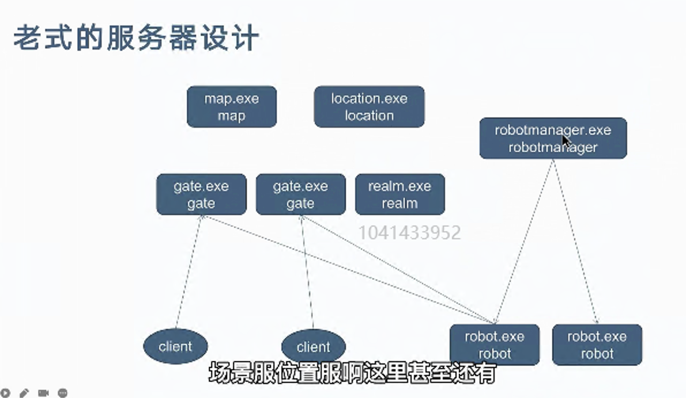

很多多进程的设计，都把一个服务整理成一个exe。多个服务就有多个exe，代码可能是高度相似的，或者基本一样的。只是启动时环境变量不同。合并成一个exe并设置环境变量。

- 发布部署简单、配置资源方便、多种服务共用进程。
- 结构调整容易，比如两种或多种服务要合并，拆分
  - 多个exe会有多个进程，当其中一部分逻辑压力过大时（比如一个中心服有好友和组队功能，好友功能压力过大时 ）不好拆分，需要再拆成多个exe。
  - 无限增加app类型，千古风流有几十种SceneType
  - 根据配置需要什么服务，就配置什么类型。多个服务配置在一个进程内。

### 后端和机器人合并

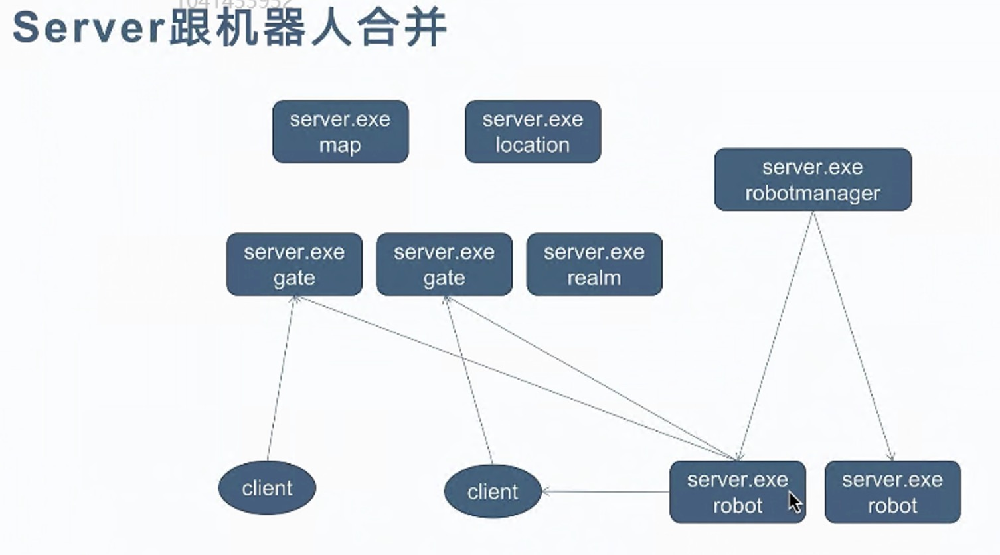

机器人和服务器的代码基本一样。也引用了大部分的后端代码。还引用了客户端的逻辑代码。代码引用很乱。

机器人要单独起一个exe很不方便，跑测试需要起两个进程。

#### server和机器人合并带来的问题

- 代码类重名
  - 合并后分别引用了客户端和服务端的代码。两端代码的类名重名（item、buff）。
  - 用命名空间隔离解决重名冲突，带来的好处只需要检查目录下的命名空间就能保证不会调用到错误的代码。
  - ET.Server、ET.Client
- 事件订阅怎么区分前后端
  -  有些工具类，或数值组件这种两端共用的代码就不用隔离。ET
  - 比如单位组件，前后端都有抛出的事件很难做区分。需要区分订阅。
  - 通过场景类型做区分SceneType
- 配置文件结构不同怎么共享
  - 问题也不大，大不了两端配置都存在。

机器人在写组队逻辑时很有用。

### 前端跟后端合并

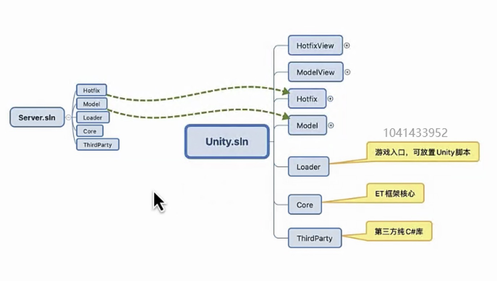

#### 不需要单独起服务端，前后端代码共享更方便

不需要单独启动服务器，unity一启动就启动前后端代码。

前后端代码的共享，前端可以包含一个服务器，后端可以包含前端的逻辑做个机器人。

#### 后端可以更方便做Unity可视化工具，可视化树ENABLE_VIEW

后端如果是命令行程序，做数据可视化很困难。

写后端就像写前端一样简单，比如写个行为树，后端可以直接调试，前端可以直接拿到后端数据。

ET7加上ENABLE_VIEW宏开启可视化树

#### 更方便做插件机制

用unity的导入导出做插件机制。

#### 各种游戏代码合并的需求分析

##### 竞技游戏

比如守望先锋，用的状态帧同步。本地先预测下一帧行为，服务器同步下来如果结果不符合则进行回滚。那么两端肯定有相同代码，否则产生结果肯定是不一致的。

##### MMO游戏、MOBA游戏

模拟机器人的需求，充当普通玩家。

机器人压测需求。

##### 状态同步

客户端预测和服务器权威数据跑的代码基本一致。

##### 帧同步

逻辑都在客户端，但是在结算结果的时候数据不权威。后期帧同步，很多是依靠服务器也跑一份逻辑，根据跑出来的结果判定结算。也是防作弊很重要的内容。

### 前端和后端合并的细节问题

#### 怎么区分编译前端代码跟后端代码，还有双端编译

搞一个编译工具，按照需求选择编译

#### 配置要区分前端跟后端，以及双端，configpatial的处理

有些配置不需要双端都知道的，比如前端的特效，或后端比较权威计算的数值。

这就需要导出三份配置。C、CS、S

config patial就是把配置反序列化成需要的类对象的工具

config patial不能共享，需要写三份。

消息要区分前后端，以及双端。

#### 总结

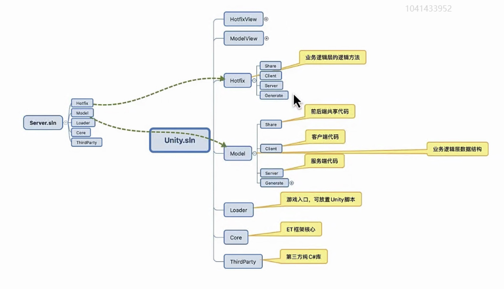

把服务器逻辑代码也写在客户端程序集内，直接引用。

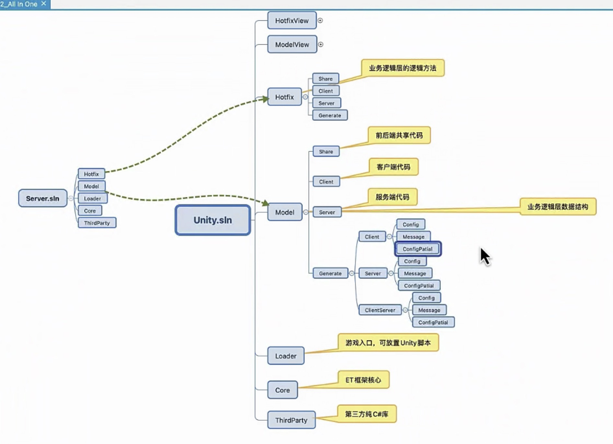

## 第三节 单间管理器

### 为什么需要单间管理器？

#### 统一管理单间类。单间类的问题？

单间类生命周期的问题，创建了什么时候释放的问题。

内存随着生命周期清理的问题。

#### 统一管理基础库，灵活引入基础库

#### 消除静态字段

`static Dictionary`这种静态变量，生命周期清理的问题。

#### Unity domain模式

domain模式为了提升性能不清理静态字段，需要自己清理。

#### 为什么不用组件？

组件本身需要一些额外的东西，比如创建的时候需要对象池。对象池又是谁管理。就可以使用单间管理器创建对象池。

#### 为什么用Game.AddSingleton 创建单间

`Game.AddSingleton<TimeInfo>();`

##### 代码可读性，明确知道单间初始化的地方。

如果都是`Instance`很难找到哪里是初始化的地方。

##### 明确知道初始化顺序，方便调整

##### 好释放，相反的顺序释放

明确知道了初始化顺序，能更明确释放的顺序。

```c#
public interface ISingleton: IDisposable
{
    void Register();
    void Destroy();
    bool IsDisposed();
}
public class Singleton<T>: ISingleton where T: Singleton<T>, new(){

}
```

##### 通过接口创建生命周期

`ISingletonAwake` 、`ISingletonUpdate` 、`ISingletonLateUpdate`

`AddSingleton`时判断是否有生命周期接口，如果有添加对应生命周期。

```c#
public static void AddSingleton(ISingleton singleton)
{
    Type singletonType = singleton.GetType();
    if (singletonTypes.ContainsKey(singletonType))
    {
        throw new Exception($"already exist singleton: {singletonType.Name}");
    }

    singletonTypes.Add(singletonType, singleton);
    //管理单间加载顺序，做卸载时可用
    singletons.Push(singleton);

    singleton.Register();

    if (singleton is ISingletonAwake awake)
    {
        awake.Awake();
    }

    if (singleton is ISingletonUpdate)
    {
        updates.Enqueue(singleton);
    }

    if (singleton is ISingletonLateUpdate)
    {
        lateUpdates.Enqueue(singleton);
    }
}
```

## 第四节 多线程、单线程、Task await async的关系

### 多线程

使用多线程去执行复杂逻辑时，callback会在执行线程继续执行进行响应。

比如寻路的逻辑比较复杂抛给其他线程去处理，响应回调时也是会在寻路线程进行响应。

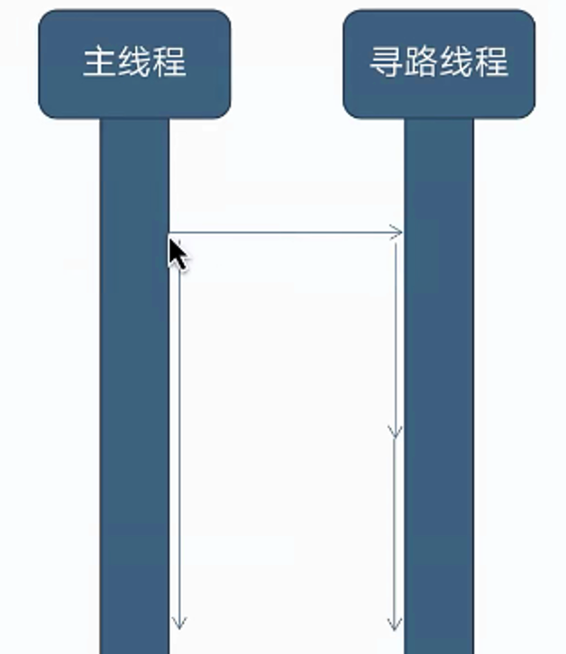

#### 遇到的问题

当遇到框架内的api都是单线程的api时，必须在主线程完成回调。在其他线程响应回调会导致线程竞争。

解决方法也很简单，在其他线程响应回调时把回调放到一个缓存队列中（需要同步上下文），在主线程的update里不断去取缓存队列中的响应，并去执行它。就能把回调丢回到主线程执行。(C++中的没有task而使用的手法)

详情看看MainThreadSynchronizationContext这个类

### Task

线程消耗比较大，创建的时候一般都使用线程池。Task就是线程池封装的结果。

Task 执行的线程和响应回调的线程不一致，回调的响应会丢到其他线程执行。

Task本质就是个状态机，当设置了同步上下文时，回调会被自动调整到主线程执行。 编译器帮我们做了这一步

```c#
public static async void StartTask(){
	SynchronizationContext synchronizationContext = SynchronizationContext.Current;
    await Task.Run(FindPath);
    if(synchronizationContext == null){
        //没设置同步上下文会在当前线程响应。
        SendMessage();
    }else{
        //设置了同步上下文实际会在设置的线程响应。
        synchronizationContext.post(()=>{
            SendMessage();
        },null);
    }
}
```

### 自己实现个TaskRun

```c#
 public static async Task Run(Action action)
        {
            TaskCompletionSource tcs = new TaskCompletionSource();
            ThreadPool.QueueUserWorkItem((_) =>
            {
                action.Invoke();
                tcs.SetResult();
            });
            await tcs.Task;
        }
public static async void StartTask(){
    await Run(FindPath);
    //这里把回调和多线程的调用放在同个方法执行
    SendMessage();
}
```

使用`Task.Factory.StartNew`创建可以自由调度的线程

```c#
 public static async void StartTask()
        {
     //MyTaskScheduler是自己实现的线程调度器
            await Task.Factory.StartNew(FindPath,new CancellationToken(),TaskCreationOptions.None,new MyTaskScheduler());
        }
```

### 自定义线程调度器

继承`TaskScheduler`实现自己的线程调度器

```c#
public class MyTaskScheduler:TaskScheduler
        {
            protected override IEnumerable<Task> GetScheduledTasks()
            {
                return null;
            }

            protected override void QueueTask(Task task)
            {
                //执行完回收到线程池
                ThreadPool.QueueUserWorkItem((_) => TryExecuteTask(task));
            }

            protected override bool TryExecuteTaskInline(Task task, bool taskWasPreviouslyQueued)
            {
                throw new NotImplementedException();
            }
        }
```


## 第五节 ETTask

### 回调地狱 Callback Hell

Task主要是为了解决回调地狱 

在没有协程和await之前，cpp主要靠函数对象模拟Lambda。 

后续谷歌推出NewCallback

C# 5.0 推出了 await async 关键字

await难以维护的操作`while await`，await all 所有任务才执行回调。

go python js ts cpp后续也推出了await关键字，但是go的await不完善，是通过线程的方式去执行。比如玩家有的操作是需要单线程等待一段事件再执行的，回调则会执行在其他线程中。而好的设计则应该是只把回调拉直，而不关心你后续实现是在多线程还是单线程。

### 回调转成Task

`TaskCompleteSource`

```c#
public async ETTask FindPath(){
    TaskCompletionSource tcs = TaskCompletionSource();
    ThreadPool.QueueUserWorkItem( state=>{
       Consle.WriteLine("FindPATH");
        tcs.SetResult();
    });
    await tcs.Task;
}
```

`CancellationTokenSource` await的取消操作

传入token，通过token状态来判断后续代码是否执行。 

### ETTask的好处

生成代码极简，去除了多线程的支持，性能最好。

对象池消除了Task GC

`TaskCompleteSource`和`CancellationTokenSource`这两个类比较庞大并且没有入池，gc问题比较严重。

去掉了ETVoid 

ETVoid对应 async void。任何异步都返回ETTask。不需要等待则直接Coroutine。操作简单。

### 线程取消

- 超级简单的ETCancelToken

  ETCancelToken替换`CancellationTokenSource`

- 协程取消判断

  ```c#
  if(cancellationToken.IsCancel()){
  	Console.WriteLine("Start cancel");
  	return;
  }
  Console.WriteLine("Start finish");
  ```

  在ETTask中判断ETCanelToken是否取消然后继续执行后面操作。而Task在取消后则抛出异常。

- ETCancelToken取消多个协程

  多个ETTask判断同一个ETCancelToken

- ETCancelToken的必要性

  尽可能设计一个await的取消方式，否则后续维护扩展非常困难。

### awaitable

#### GetAwaiter

c#提供的`GetAwaiter`的机制，只要对象有一个成员方法或者静态方法名为`GetAwaiter`，就可以使用await的语法。

#### Unity yield转换

本质上也是回调操作，把yield用await的形式更加简单。

```c#
//unity中yield都会返回AsyncOperation的子类
public static async ETTask GetAwaiter(this AsyncOperation asyncOperation){
    ETTask task = ETTask.Create(true);
    //SetResult执行后会回到await后的操作。
    asyncOperation.completed += _=>{ task.SetResult();};
    await task;
}
```

```c#
public static async ETTask<string> HttpGet(string link){
    try{
        UnityWedRequest req = UnityWebRequest.Get(link);
        //req.SendWebRequest()会返回UnityWebRequestAsyncOperation，继承于AsyncOperation
        await req.SendWebRequest();
        return req.downloadHandler.text;
	}
    catch{
        throw new Exception();
    }
}
```

## 第五节 -2 ETTask源码分析

用反编译工具`.NET Reflector`查看ETTask实现。

这里需要反复看生成概念。

本质上是基于状态机的实现，执行时通过判断ETTaskCompleted的值来判断是否走到后面的逻辑，如果需要等待则将状态机的`MoveNext`方法传到ETTask的CallBack中。通过状态机的状态变化继续后面的逻辑。 ETTask的`SetResult`操作会触发回调，执行状态机的`MoveNext`。

实际上是把await前的代码和await后的操作，各放在一个状态中，通过状态机切换来执行。保证了上下文的统一。

多个await会生成多个状态机

#### ETTask

只要用了`ettask.Coroutine()`在编译后会生成一个`ETAsyncTaskMethodBuilder.Create()`

#### ETAsyncTaskMethodBuilder

struct类型，包含一个ETTask。

在方法执行了Coroutine编译后会对应生成一个相对的struct，继承于`IAsyncStateMachine`。生成一个状态机，根据state参数执行相对应阶段的代码。

#### ETVoid

#### ETAsyncVoidMethodBuilder

#### ETTaskCompleted

返回完成状态，基本是true

#### ETAsyncTaskCompletedMethodBuilder

### 协程的使用

用协程简化工作流程。

`int result = await OpenBox();`弹窗时返回点击按钮的type做相应的判断，简化在窗口里写逻辑，逻辑上更清晰。(有点像VB的弹窗返回值

 `await MoveTo();`

`await ChangeScene();` 切换场景的操作写成一个方法，await后执行切换场景完成后的代码。

`await CastSpell();` 释放技能，技能成功或失败后的操作。比如失败时使用道具，成功后捡道具。如果用事件则会变得很复杂。 

熊猫哥举了个例子，比如自动寻路时，需要通过几个场景的传送门才能到达最终场景。先把场景选出来，给每个场景写一个最短路径的寻路方法。根据读配置去执行相应的寻路方法。只需要通过一个while循环就能到达最终目标位置。

把逻辑异步化后，逻辑更清晰，只需要对内容进行封装抽象不需要再关心后续的逻辑了。

## 第六节 计时器

`TimerComponent`

### 需求场景

- UI倒计时
- 网络超时
- 技能释放
- buff超时删除，定时事件

### Task.Delay的问题

C#提供的定时器`Task.Delay`。

- 跨线程
  - `Task.Delay`是跨线程的，会把await的回调放在其他线程执行。
- 性能
  - 如果需要把回调设置到主线程，就需要设置同步上下文`SynchronizationContext synchronizationContext = SynchronizationContext.Current;`。把action post到主线程，性能很糟糕
- CancleToken抛异常
  - 抛异常的性能问题
  - 不执行后续操作
- GC
  - 基于Task实现 有GC

### 实现

#### 代码实现

##### 相对时间

`public async ETTask WaitAsync(long time,ETCancellationToken cancellationToken = null)`

##### unix绝对时间

`public async ETTask WaitTillAsync(long tillTime,ETCancellationToken cancellationToken = null)`

相对时间的会跟随帧率 或 线程情况受影响。而绝对时间则是跟随unix时间。在时间达到时，无论什么情况都会执行。

##### 计时器

`public long NewOnceTimer(long tillTime,int type,object args)`

为什么不用callback？

计时器里可能会有泄露，方便查找泄露。callback没法热重载，基本不用callback。

跟WaitAsync的区别？

时间长时，用`NewOnceTimer`，可以热重载。而`WaitAsync`不能热重载。

#### 数据结构

MultMap 管理时间线，在每个时间点插入一个list管理多个计时器。插入list的操作有gc，用对象池创建的话会有回收问题，一直创建池子只会越来越大，在切换场景的时候回收。

Remove细节，只从timerActions中删除。不删除MultMap 管理的计时器，MultMap管理的List插入删除都会影响性能。时间到了从MultMap 取出执行时，判断是否在timerActions中，如果在再执行。

WaitAsync ETCancellationToken怎么判断去取消。

## 第七节 协程锁

`CoroutineLockComponent`

### 使用场景

- 协程并发造成协程竞争，类比于线程竞争
- unity资源加载
  - 同时异步加载同一个资源会报错
  - 如果打标记后续逻辑比较不好扩展，比如要做await操作。
- 加载mail数据
  - 不同服务器玩家数据的竞争
- unit消息队列，上线下线
  - 玩家下线了，但是有些异步操作还没完成。
- 数据库查询保存队列，防止并发过多
  - mongodb数据的并发数量是有限的。

用了协程锁后，协程则是并列进行。

### 死锁

#### 协程锁中再次获得同一把锁

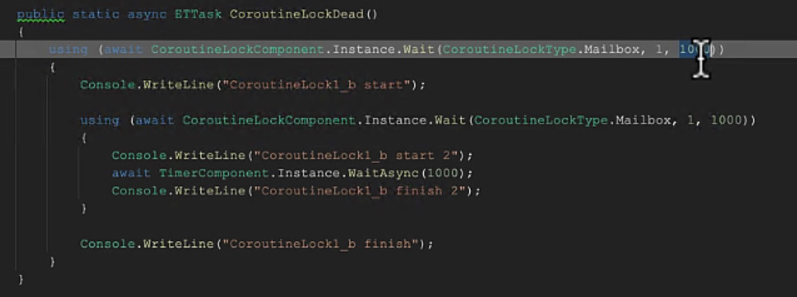

#### A B互相等待 

#### 想象不到的死锁


两条没有关联的消息正好在同一时间请求，请求的内容都需要用到同一把锁。就造成了死锁。

这种情况比较罕见，要么改成请求锁的地方统一通过转发形式。要么干脆直接不处理了。

### 协程队列实现

CoroutineLockComponent

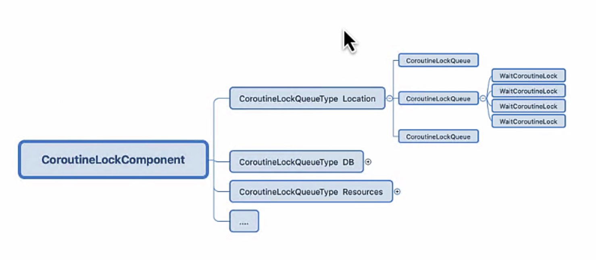

- 协程锁划分类型
  - 不同类型的锁没必要等，比如资源和数据。
- 同一个类型，再根据id划分协程锁队列。
- 同一个类型，并且id相同则在同一个队列中，并列执行。

CoroutineLockQueueType

CoroutineLockQueue 对象池

### 问题

为什么不用池？不用struct？

超时实现

## 第八节 协程同步

三件套`ETTask`、`协程锁`、`WaitAll`

在使用waitAll时需要考虑是否能并发，是否需要并发。

`ETTaskHelper.WaitAll`

### 使用场景

#### 资源加载并发

`ResourceComponent`实现了并发加载资源

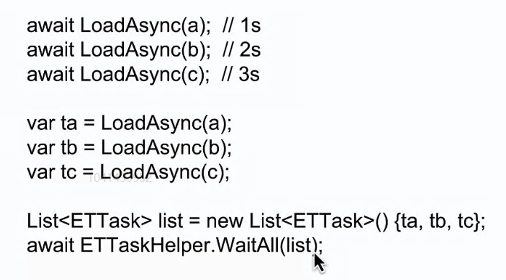

#### 机器人登录并发

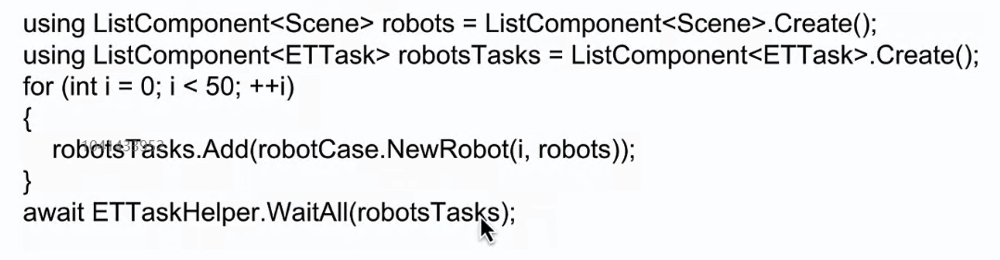

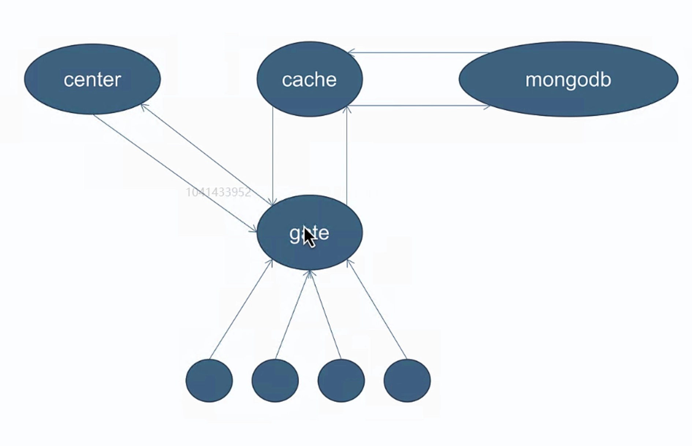

每个流程都可以实现并发

### WaitAll实现

#### 线程同步barrier

可以参考barrier

1. 主协程要阻塞住
   - 主协程wait
2. 所有子协程执行完，要通知主协程往下执行
   - 子协程执行完有个回调，至少有个setResult的操作
     - 用计数形式，每执行完一个子协程，count-1，count=0时表示子协程都执行完毕。
   - 主协程在所有子协程都执行完后才开始执行，就需要判断。
     - 在主协程开始时，判断计数是否为0，为0时直接执行。不为0时创建个ETTask等待。
3. Cancel的判断
   - WaitAll取消的操作

### WaitAny

有任一一个协程执行完则返回。

#### 实现

计数设置为1，执行完一个-1，count<=0返回

## 第九节 ID TimeInfo ObjectPool

### ID跟InstanceID

ID是逻辑上的，InstanceID是对象的