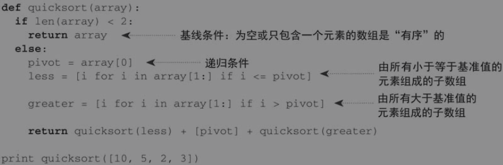
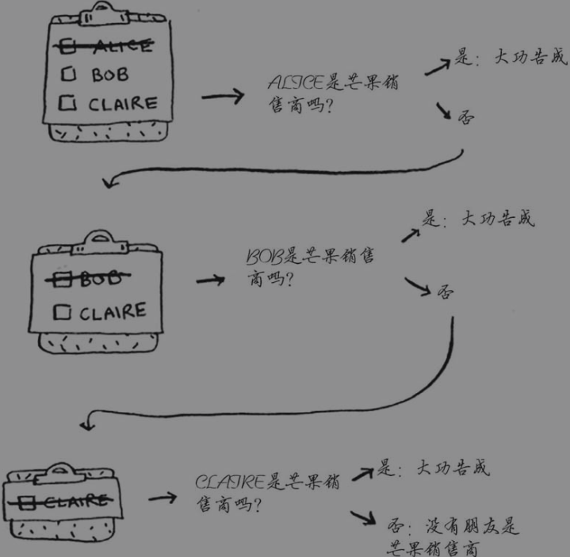
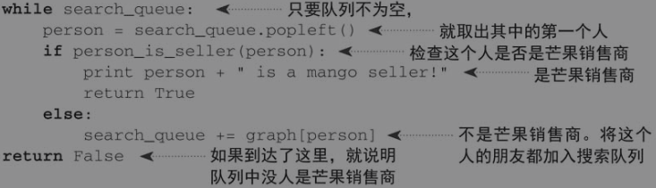
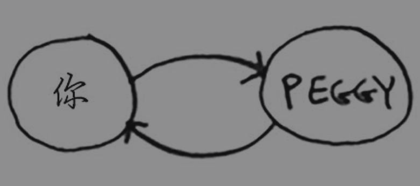
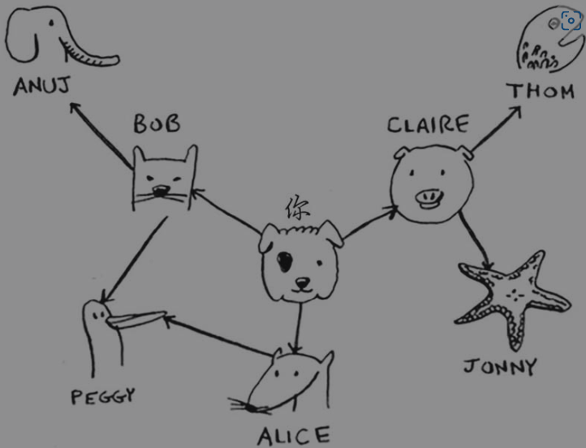
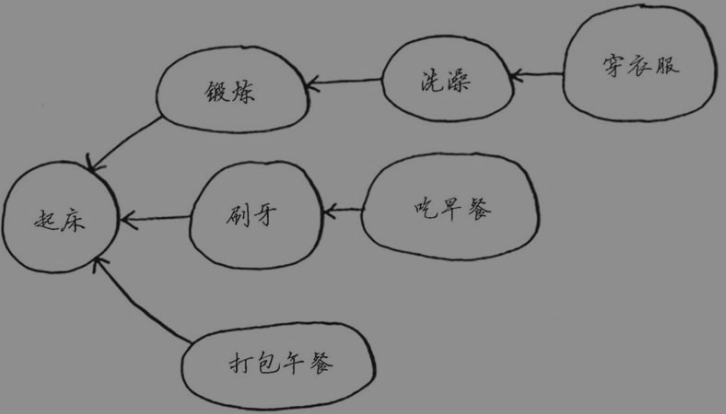

# 《算法图解》笔记

## 3.1递归

如果使用循环，程序的性能可能更高；如果使用递归，程序可能更容易理解。

## 3.3栈

### 调用栈(call stack)

当调用函数时,计算机会将函数调用涉及的所有变量的值存储在内存中。并给这个函数调用分配一块内存。计算机用一个栈表示这些代码块，先调用的函数在栈底，后调用的函数在栈顶。

**调用另一个函数时，当前函数暂停并处于未完成状态。该函数的所有变量的值都还在内存中。**执行完函数greet2后，你回到函数greet，**并从离开的地方开始接着往下执行。**

**递归函数实际在也是栈的调用**

**使用栈虽然很方便，但是也要付出代价：存储详尽的信息可能占用大量的内存。每个函数调用都要占用一定的内存，如果栈很高，就意味着计算机存储了大量函数调用的信息。**

在这种情况下，你有两种选择。

-  重新编写代码，转而使用循环。
-  使用尾递归。

## 4.1分而治之(D&C)

快速排序是一种使用D&C的排序算法

D&C算法是递归的，使用D&C解决问题的过程包括两个步骤。

1. 找出基线条件，这种条件必须尽可能简单。
2. 不断将问题分解（或者说缩小规模），直到符合基线条件。

D&C并非可用于解决问题的算法，而是一种解决问题的思路。

## 4.2快速排序

C语言标准库中的函数qsort实现的就是快速排序。

## 5.1散列函数

散列函数“将输入映射到数字”。散列函数本质上是一种映射，通过将字节数组或字符数组进行hashcode函数计算，映射为非负整数值。

散列函数总是将同样的输入映射到相同的索引。

散列函数将不同的输入映射到不同的索引。

### 冲突

当给两个键分配的位置相同时,就造成了冲突

#### 处理冲突的方式

处理冲突的方式很多，最简单的办法如下：如果两个键映射到了同一个位置，就在这个位置存储一个链表。

- 散列函数很重要。前面的散列函数将所有的键都映射到一个位置，而最理想的情况是，散列函数将键均匀地映射到散列表的不同位置。
- 如果散列表存储的链表很长，散列表的速度将急剧下降。然而，如果使用的散列函数很好，这些链表就不会很长！

### 性能

在最糟情况下，散列表的各种操作的速度都很慢。因此，在使用散列表时，避开最糟情况至关重要。为此，需要避免冲突。而要避免冲突，需要有：

- 较低的填装因子。
- 良好的散列函数。

#### 装填因子

**散列表使用数组来存储数据，因此你需要计算数组中被占用的位置数。**

当数组有五个位置，其中有两个被占用了。则该散列表的装填因子为2/5，即0.4

**填装因子度量的是散列表中有多少位置是空的。**

当装填因子大于1时，说明数量超过了数组的容量。

**一旦填装因子开始增大，你就需要在散列表中添加位置，这被称为调整长度（resizing）。(字典当超过容量时，则会进行扩容。扩容至一倍的长度)。**

一个不错的经验规则是：一旦填装因子大于0.7，就调整散列表的长度。

散列函数的结果必须是均匀分布的，这很重要。它们的映射范围必须尽可能大。最糟糕的散列函数莫过于将所有输入都映射到散列表的同一个位置。

### 小结

- 可以结合散列函数和数组来创建散列表。
- 冲突很糟糕，你应使用可以最大限度减少冲突的散列函数。
- 散列表的查找、插入和删除速度都非常快。
-  散列表适合用于模拟映射关系。
-  一旦填装因子超过0.7，就该调整散列表的长度。
-  散列表可用于缓存数据（例如，在Web服务器上）。
-  散列表非常适合用于防止重复。

## 6.1广度优先查找

**广度优先搜索找出两样东西之间的最短距离**

解决最短路径问题的算法被称为广度优先搜索。

广度优先查找实际上就是遍历有向图，直到找到想要结果为止。 

**在广度优先搜索的执行过程中，搜索范围从起点开始逐渐向外延伸，即先检查一度关系，再检查二度关系。**

需要按添加顺序进行检查。有一个可实现这种目的的数据结构，那就是**队列（queue）**。

### 代码实现

思路：先将起始节点进行判断是否为目标，不是目标则将它的邻居添加入队列中，遍历每个邻居判断是否为目标，不是目标则继续将邻居的邻居添加入队列中以此类推直到找到为止。

易错点：当检查完一个人后，应将其标记成已检查，且不再检查他

如果不这样做，就可能会导致无限循环。

可以使用一个散列表对检查过的人进行保存。

### 运行时间

广度优先搜索的运行时间为O(人数+边数)，这通常写作O(V+E)，其中V为顶点（vertice）数，E为边数。

### 图

#### 有向图

Anuj、Peggy、Thom和Jonny都没有邻居，这是因为虽然有指向他们的箭头，但没有从他们出发指向其他人的箭头。这被称为有向图（directed graph），其中的关系是单向的。因此，Anuj是Bob的邻居，但Bob不是Anuj的邻居。无向图（undirected graph）没有箭头，直接相连的节点互为邻居。

#### 无向图

没有箭头,直接相连的节点互为邻居

如果任务A依赖于任务B，在列表中任务A就必须在任务B后面。这被称为拓扑排序，使用它可根据图创建一个有序列表。

**a指向b**

在拓扑排序中的指向表示依赖，即a依赖b，所以b在a前面出现(拓扑排序强调的是所有节点是一种线性次序允许存在节点a被节点b、c同时依赖，但不能存在环。若存在环则不是拓扑排序)。

**在广度优先搜索中指向有层级的概念，即想要访问b必须先访问a，所以a比b先出现。**

## 7.1狄克斯特拉算法

**查找从起点到终点耗时最短的路径**