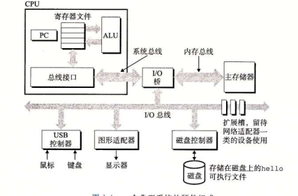
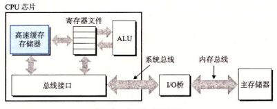
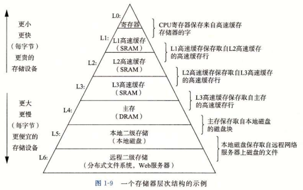
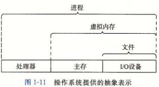
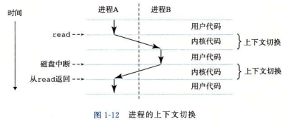
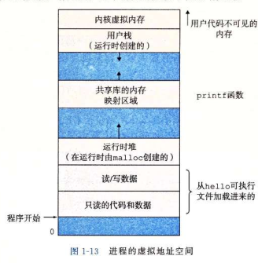

# CSAPP

## 第一章 计算机系统漫游

### 1.1 信息就是位+上下文

由ASCII字符构成的文件称为文本文件，其他文件都称为二进制文件。

在不同的上下文中，一个同样的字节序列可能表示一个整数、浮点数、字符串或机器指令。

### 1.2 程序被其他程序翻译成不同格式

一个c语言程序可以被编译器编译至不同格式运行于不同的平台

c语言程序的翻译过程分为四个阶段

1. 预处理器

   预处理器读取c程序中引用的头文件，然后插入到程序文本中生成新的c语言文件

2. 编译阶段

   编译器把c语言文件编译成汇编语言程序

3. 汇编阶段

   汇编器把汇编语言程序翻译成机器语言

4. 链接阶段

   链接器负责将已经编译好的文件合并到所需要的程序中，合并后得到可执行文件

### 1.3 了解编译系统如何工作是大有益处的

编译的结果很重要，所以了解如何编译以及编译的流程很重要。

- 优化程序性能
  - 编译出来的内存大小
  - 程序运行的速度
  - 程序运行时的内存占用
- 理解链接时出现的错误
- 避免安全漏洞
  - 避免堆栈溢出

### 1.4 处理器读并解释存储在内存中的指令

这一小节记住硬件都是通过总线进行通讯，以及各硬件的组成与功能

#### 1.4.1 系统的硬件组成

1. 总线

   各个硬件中传输数据的桥梁，传输定长的字节块，也就是字。一个字是一个基本的系统参数，也就是一次传输的最大数量。一般为4个字节或8个字节（也就是32位和64位）

2. I/O设备

   输入和输出设备是与外界的接口。每个I/O设备都通过一个控制器或适配器与IO总线相连。控制器是在I/O设备上或主板上的芯片组，适配器则是硬件扩展（比如网卡、声卡）。

3. 主存储器

   物理上是一组动态随机存取存储器芯片组成。逻辑上则是一个线性的字节数组。每个字节都有唯一的地址。

4. 处理器

   在任何时刻，PC都指向主存中的某条机器语言指令。

   从通电开始到断电结束，处理器一直在不断地执行程序计数器指向的指令，再更新程序计数器来指向下一条指令。（与图灵机不同的是下一条指令地址不一定相邻）

   指令执行的过程：

   - 加载

     从主存复制一个字节或一个字到寄存器，覆盖原有内容。

   - 存储

     从寄存器复制一个字或一个字节到主存，覆盖原有内容。

   - 操作

     把两个寄存器的内容复制到ALU做算术运算，并将结果放到一个寄存器中，覆盖原有内容。

   - 跳转

     从指令本身抽取一个字，并将这个字复制到程序计数器中，覆盖原有内容。
   
   现代处理器比较复杂，所以将处理器的`指令集架构`和`微体系结构`区分开来。
   
   指令集架构：描述每条机器代码指令的效果
   
   微体系结构：描述处理器的实现

### 1.5 高速缓存至关重要

**一些访问频繁的数据尽可能让他进入高速缓存存储器，这样能加快运行时的速度。（CPU在处理数据时，大部分开销都是一层又一层存储器之间的数据复制操作）**

高速缓存存储器（cache）位于寄存器和主存之间的存储器。

传输速度快慢（这里主要用于CPU运算，CPU读取速度的对比）

​	`外存储器<主存储器<高速缓存存储器<寄存器`

#### 三级缓存

一般分为三级缓存，L1、L2、L3

- L1位于处理器芯片上，处理器访问速度和寄存器基本一致
- L2通过一条特殊总线连接到处理器。比访问主存快5~10呗
- L3一般在存储器外，为多个CPU共享

#### 为什么只有三级缓存？

缓存多了，数据传输时被复制的次数多了反而时间开销更大。还有就是检索数据应该放在哪级缓存的时间。

### 1.6 存储设备形成层次结构

上一层的存储器作为低一层存储器的高速缓存。可以利用存储器层次结构的理解来提升程序性能。

### 1.7 操作系统管理硬件

操作系统连接应用程序和硬件。应用程序必须通过操作系统才能操作硬件。

操作系统两个基本功能：

1. 防止硬件被失控的应用程序滥用。
2. 向应用程序提供接口来控制硬件

操作系统通过几个抽线概念实现两个基本功能：

- 文件 I/O设备的抽象表示
- 虚拟内存 I/O设备、主存的抽象表示
- 进程  I/O设备、主存、处理器的抽象表示

#### 1.7.1 进程

一个系统上可以同时运行多个进程，每个进程都好像在独占硬件。

进程之间是**并发执行**的，一个进程的指令和另一个进程的指令是交错执行的。

**进程的并发执行是通过处理器在进程间切换来实现的**。操作系统实现的交错执行机制称为**上下文切换**。

操作系统保持跟踪运行所需的所有状态信息，称为**上下文**。

进程之间的转换是通过操作系统内核管理的。内核是操作系统代码常驻内存的部分。内核是系统管理全部进程所用代码和数据结构的集合。

#### 1.7.2 线程

**一个进程由多个线程的执行单元组成**

**每个线程都运行在进程的上下文中，共享同样的代码和全局数据。**

多线程之间比多进程之间更容易共享数据。多处理器可用时，多线程更快。

#### 1.7.3 虚拟内存

虚拟内存为每个进程提供一个假象，即每个进程都在独占地使用主存。

每个进程看到的内存都是一样的，称为`虚拟地址空间`。

